# 数字音视频信号技术

## 一、视频和图像编码

### 要点

+ 图像视频压缩的概述和目的
+ 数字视频色彩空间
  + **YUV** 和其采样

+ 彩色电视制式
+ 熵编码
  + **编码效率**
  + **哈夫曼编码**
  + **算术编码**

+ 预测编码
  + **DPCM 概述**
  + **MV 二维对数搜索算法**

+ 变换编码
  + **DCT 的性质**

+ 现代视频格式
+ JPEG
+ MPEG

### 1.1 图像视频编码概述

数字视频信号是在采集过程中，通过对模拟信号进行采样和量化后获得的。未经过压缩的初始视频信号所需要的存储空间为：
$$
视频比特数=采样频率\times量化位数\times视频宽\times视频高\times帧率\times时间
$$
没有压缩过的原始视频体积一般较大，不符合传输要求，因此，要利用信号本身的一些对原始信号进行压缩和编码。现代网络视频编码不仅要求能够减少视频体积，还要求视频能够便于在网络中按照特定协议进行传输，并且能够被快速解析。

### 1.2 信号冗余

一般的，信号在频率域和时域上存在一些冗余。对于视频和图像信号，一般有：

+ 空间冗余：图像内容各部分有很大相似性，如蓝天背景；
+ 时间冗余：相邻的两帧图像间部分或全部区域相似，或者完全一致，如一段静物景象；
+ 结构冗余：图像部分符合特定模式重复出现，如纹理；
+ 编码冗余：也称符号冗余，图像编码中存在信息冗余，可以用香农熵理论进行解释；
+ 视觉冗余：人眼对图像的感知是非均匀和非线性的，对图像各部分的敏感度不同，一些图像细节不需要较高分辨率；
+ 知识冗余：在一些特定场合中，视频信号中的信息与某些先验知识相关，如人的五官相对位置，可以对这些知识进行建模。

### 1.3 通用视频中间格式

视频信号传输技术最早被使用在电视产业中，为了保证工业上的标准性，业界定制了一些被称为通用中间格式（Common Intermediate Format，CIF）的格式标准。这些标准规定了视频的大小格式，而不是编码格式。

在传统数字电视系统中，国际电报电话咨询委员会（CCITT）规定了：

+ SQCIF：128x96
+ QCIF：176x144
+ CIF：352x288
+ 4CIF：720x576

现代通用视频标准有：

+ SD：标清，480p，720x576
+ HD：高清，720p，1280x720
+ FHD：全高清，1080p，1920x1080
+ UHD：超高清，4K，3840x2160
+ FUHD：全超高清，8K，7680x4320

### 1.4 彩色电视制式

传统电视系统中有三种常用的彩色电视制式：NTSC，PAL，SECAM 。

#### 隔行扫描

和现代网络视频不同，传统电视信号大多使用**隔行扫描（interlaced scanning）**技术。电视信号在输出时，首先输出所有奇数行的信号，再输出偶数行信号，人眼难以察觉到信号输出间的延迟，因此视频图像可以更快的显示在屏幕上。一般的，使用隔行扫描输出的视频格式会在尾部加上字母 i ，如 1080i 表示隔行扫描的全高清视频。

#### NTSC

NTSC(National Television Systems Committee)彩色电视制是 1952 年美国国家电视标准委员会定义的彩色电视广播标准，称为正交平衡调幅制。NTSC 的特点有：

+ 每帧 525 行，帧率 29.97 fps ；
+ 电视纵横比 4:3，电影 3:2 ，高清电视 16:9 ；
+ 隔行扫描；
+ 颜色模型使用 YIQ 。

#### PAL

由于 NTSC 存在相位敏感造成彩色失真的缺点，联邦德国在 1962 年制定了 PAL(Phase-Alternative Line) 电视标准，这也是我国正在使用的标准电视制式。PAL 的特点有：

+ 每帧 625 行，帧率 25 fps；
+ 纵横比 4:3；
+ 隔行扫描；
+ 颜色模型使用 YUV 。

####  SECAM

SECAM 是由法国、俄罗斯和一些东欧国家使用的电视制式，图像格式为 4:3，625 线，50 Hz，6 MHz 电视信号带宽，总带宽8MHz。

### 1.5 YUV 颜色模型

在视频编码中，最常使用的颜色模型是 Y'CrCb 模型，工业上一般称为 **YUV 颜色模型**。该模型采用亮度 + 色度的方式表示像素块颜色，其中 **Y 分量**表示亮度，**U 分量（Cb）**表示蓝色投影，**V 分量（Cr）**表示红色投影。

由于人眼对亮度信息的敏感度要高于色度信息，利用该视觉冗余特性，YUV 适当降低了色度分量的采样率，因此减少了传输带宽并不会对图像质量产生太大影响。YUV 主要有四种采样格式：4:4:4，4:2:2，4:2:0，4:1:1 。

#### 4:4:4 采样

以 PAL 制式为例，4:4:4 方法按以下方式采样：

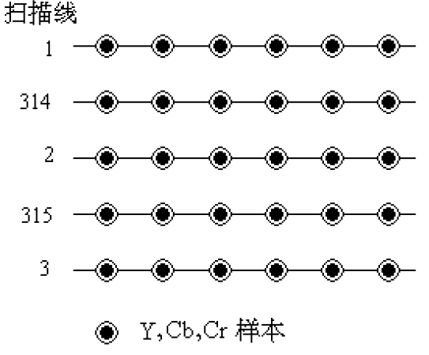

即对于每个像素，都进行 YUV 分量的采样。

#### 4:2:2 采样

以 PAL 制式为例，4:2:2 方法按以下方式采样：

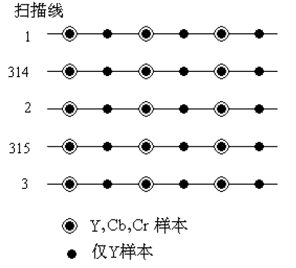

即在每行中，间隔两个像素进行一次 UV 采样（取两个像素的 UV 平均值），而对每个像素都进行 Y 采样。

#### 4:1:1 采样

以 PAL 制式为例，4:1:1 方法按以下方式采样：

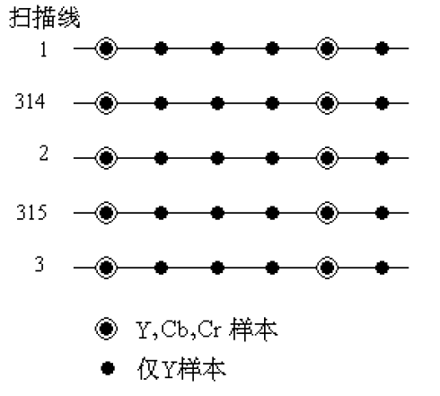

即在每行中，间隔四个像素进行一次 UV 采样（取四个像素的 UV 平均值），而对每个像素都进行 Y 采样。

#### 4:2:0 采样

以 PAL 制式为例，4:2:0 方法按以下方式采样：

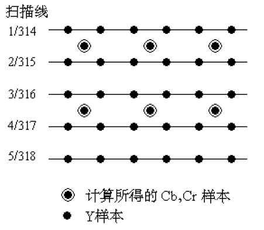

和 4:1:1 不同，4:2:0 对 UV 分量的采样是跨行的，即取一个 4x4 像素空间的 UV 平均值。

### 1.6 PCM 脉冲编码调制

**脉冲编码调制（Pulse Code Modulation，PCM）**是数字通信技术的基础，用于将模拟信号转换为数字信号，最早于 1937 年由 A·弗里斯提出，在 20 世纪 70 年代迅速发展。

PCM 将连续模拟信号转换为离散二进制数字信号，经历三个过程：取样、量化和编码。

#### 取样

**取样**也称采样或抽样，通过对模拟信号进行周期性扫描（称为**采样频率**），把时间上连续的信号变成时间上离散的信号，采样过程需要遵守奈奎斯特采样定理：信号的采样频率必须超过最高信号频率的 2 倍，否则将产生信号混叠并导致失真。

#### 量化

量化即是将采样结果离散处理，将一段连续区间内的所有模拟信号频率归于同一个离散值，一般使用二进制表示量化结果。量化结果和采样结果间的误差称为量化误差，在信号接收端将表现为噪声。为了减少噪声数量，一般采用**非均匀量化**（对不同能量区间进行拉伸或收缩）方法。非均匀量化的优点是可以减少甚至放弃出现概率小的信号范围的量化位数，分配更多的量化位数给出现概率更大的信号范围。

#### 编码

**编码**是使用有特定格式的二进制数据表示一个连续模拟信号离散值的过程，由于量化和编码通常是同时进行的，编码也被称为模数转换（A/D）。

### 1.7 图像编码

和其他通信技术类似，视频图像通信技术也有通用的描述模型。对于视频图像信号，该模型各步骤可以概括和解释为：

1. 信源采样：获取图像视频信号，将模拟信号转换为数字信号；
2. 信号预处理：使用数字图像处理技术处理未压缩的像素位图；
3. **信源编码**：对图像信号内容进行编码，目的是减小图像信号冗余度以**降低传输带宽**，如 JPEG 编码能够减少图片大小；
4. **信道编码**：对信号各部分按照一定通信协议进行封装，目的是使图像视频信号**更适合在本地或网络环境中进行传输**，如 WebRTC 是一种适用于实时视频通信的因特网应用层协议；
5. 调制，传输和解调：将数字信号转化为模拟信号后在信道中传输，并在接收端解调为数字信号；
6. **信道解码**：信道编码逆过程；
7. **信源解码**：信源解码逆过程；
8. **信源解析**：将解码后的图像视频渲染到设备。

#### 图像压缩编码类型

图像压缩编码分为有损压缩和无损压缩两类：

+ **无损压缩**：压缩和解压不会损伤原始信号，相比有损压缩压缩率较低，常见的有 TIF、BMP、GIF、PNG 格式等，一般采用预测和熵编码；
+ **有损压缩**：压缩过程舍弃了部分原始信号，比无损压缩效率更高，一般采用变换和量化编码方法。

#### 熵编码

熵，即**香农熵（Shannon Entropy）**，是指信源中所含**平均信息量**进行无失真压缩编码的理论极限。熵编码是一类无损编码。

##### 编码效率评估

**信息量**描述的是信源中各个符号出现的不确定性。对于每个出现概率为 p(x~i~) 的符号 x~i~，其信息量 I(x~i~) 计算公式为：
$$
I(x_i)=-\log_2{p(x_i)}
$$
**信息熵** H(X) 则是信源中各个符号不确定度的数学期望，单位比特/符号，表达的是信源中每个符号的平均信息量：
$$
H(X)=\sum_{i=1}{p(x_i)I(x_i)}=-\sum_{i=1}{p(x_i)\log_2p(x_i)}
$$

由于信息熵表示信源中符号平均信息量，可以用其计算编码后的存储空间效率。首先需要计算**平均码长** $\overline{K}$：
$$
\overline{K}=\sum_{i=1}{p(x_i)K_i}
$$
**编码效率 η** 则为：
$$
η=H(x)/\overline{K}
$$

##### 游程编码

**游程编码**，也称**行程编码（Run Length Encoding，RLE)**，是一种最简单的熵编码。游程编码将二维图像转为一维描述，使用符号 + 计数的方式描述一串信号，如`aaaa bbb cc d eeeee fffffff`可以描述为`4a3b2c1d5e7f`。

游程编码特别适合二值图像的压缩和其他信源中符号数量较少的信号压缩，不适合信源符号较复杂的信号压缩。由于其简单有效的特点，游程编码经常与其他编码方式混合使用，如 JPEG 就使用了游程编码进行维度转换和压缩。

##### 哈夫曼编码

**哈夫曼编码（Huffman Coding）**过去被称作最优编码方法，依赖于对信源符号出现概率的预先统计结果。哈夫曼编码是一种可变长的前缀编码，使用一棵哈夫曼树抽象表示编码过程，将各符号转换为二进制比特串。符号出现概率越高，其串长久越短。

以信号`aaaa bbb cc d eeeee fffffff`为例，首先统计各符号出现概率：

| 符号 | 概率 |
| :--: | :--: |
|  a   | 4/22 |
|  b   | 3/22 |
|  c   | 2/22 |
|  d   | 1/22 |
|  e   | 5/22 |
|  f   | 7/22 |

然后按算法步骤形成一棵带权哈夫曼二叉树：

1. 将各符号视为一棵带权的只有一个节点的树，其出现概率为根节点权重；
2. 选择两个权重最小的树作为左右子树形成一棵新树，新的根节点权重为左右子树权重和。可以预先规定较大或较小权重为左树或右树，以 0 或 1 编码，下方例子中大树赋 1 为左树；
3. 重复步骤 2，直到最后只剩一棵二叉树，这棵树就为哈夫曼树，其根节点权值为 1；

根据得到的哈夫曼树，自上而下地根据遍历路径生成哈夫曼编码表：

| 符号 | 编码 |
| :--: | :--: |
|  a   |  00  |
|  b   | 101  |
|  c   | 1001 |
|  d   | 1000 |
|  e   |  01  |
|  f   |  11  |

根据哈夫曼编码表，生成编码后的二进制信号：`1010101010001001001000100010000111111111101010101010101`。可见哈夫曼编码结果是一种二值信号，因此特别适合再次**使用游程编码压缩**。

要对哈夫曼编码进行解码，只需查阅编码表并进行前缀匹配。

##### 算术编码

**算术编码**是一种巧妙的熵编码方法，相比哈夫曼编码，可以不用预先建立概率模型（统计详细的符号出现个数）。算术编码的结果是一串表示浮点数的二进制小数，其**小数位数**等于信源符号长度。很多算术编码技术受到美国专利的保护，侵权将导致高额罚款，因此许多 JPEG 标准的实现通常只支持哈夫曼编码。

###### 编码

算术编码需要首先获得对信源符号出现概率的初步统计，该统计可以是不准确的，不会影响编解码正确性，但是会影响编码效率。以字符串`ARBER`为例进行编码，首先建立区间表（出现次数可选）：

| Symbol | Times | *P*  |
| ------ | ----- | ---- |
| A      | 1     | 0.2  |
| B      | 1     | 0.2  |
| E      | 1     | 0.2  |
| R      | 2     | 0.4  |

算术编码本质是在进行一系列区间转换过程，首先将这些字符的区间在 [0，1) 上按概率大小分配区间：

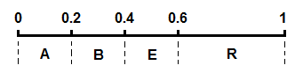

形成区间表：

| Symbol | L    | H    |
| ------ | ---- | ---- |
| A      | 0    | 0.2  |
| B      | 0.2  | 0.4  |
| E      | 0.4  | 0.6  |
| R      | 0.6  | 1    |

`L`和`H`将在之后的计算中被称为符号的**相对区间**，而区间转换会不断缩小信号的**绝对区间**上下限`high`和`low`，使用公式：
$$
low=low+（high−low）∗L\\
high=low+（high−low）∗H
$$
刚开始信号绝对区间是 [0，1)，即：
$$
low = 0\\\ high = 1
$$
第一个字符 A 的相对区间是 [0，0.2)，则 *L* = 0，*H* = 0.2：
$$
low=low+（high−low）∗L=0\\
high=low+（high−low）∗H=0.2
$$


第二个字符 R 的相对区间是 [0.6，1)，则 *L* = 0.6，*H* = 1：
$$
low=low+（high−low）∗L=0.12\\
high=low+（high−low）∗H=0.2
$$


第三个字符 B 的相对区间是 [0.2，0.4)，则 *L* = 0.2，*H* = 0.4：
$$
low=low+（high−low）∗L=0.136\\
  high=low+（high−low）∗H=0.152
$$
以此类推，最后结果区间为 [0.14432, 0.1456)，取其中一个小数作为编码结果（为避免离散浮点数运算精度问题，尽量远离边界），本例中取小数`0.14435`。

详细过程：

```json
{ low: 0, high: 0.2 }
{ low: 0.12, high: 0.2 }
{ low: 0.136, high: 0.152 }
{ low: 0.1424, high: 0.1456 }
{ low: 0.14432, high: 0.1456 }
```

###### 解码

解码小数是复原绝对区间到最终编码后的绝对区间（ [ 0, 1 ) 到 [ 0.14432, 0.1456 ) ），并观察编码小数所处区间范围和符号相对区间的绝对值是否匹配的过程。在程序运行过程中，可以将区间表视为可写表，解码小数是一个不断更新区间表的过程，每更新一次区间表就可输出一个解码字符，解码字符数量即是小数的位数。每次更新，都是将表项的相对区间值转化为绝对区间值，因此有公式：
$$
L=上一表项的L（对于第一项而言为low）\\
H=L+(high-low)*p
$$
接下来的解码过程需要参阅之前的区间表，过程为：

1. 每轮迭代从第一表项开始；
2. 如果小数不处于当前表项区间 [ L, H )，更新下一表项相对区间；
3. 如果小数处于当前表项区间，输出对应字符为解码结果，并以该表项相对区间作下一次迭代的绝对区间，开始下一轮迭代；
4. 迭代，直到输出字符数量与小数位数相等。

详细过程：

```json
// 初始绝对区间为 0, 1
Char { symbol: 'A', p: 0.2, L: 0, H: 0.2 }		
// 更新绝对区间为 0, 0.2，输出字符 A
Char { symbol: 'A', p: 0.2, L: 0, H: 0.04 }
Char { symbol: 'B', p: 0.2, L: 0.04, H: 0.08 }
Char { symbol: 'E', p: 0.2, L: 0.08, H: 0.12 }
Char { symbol: 'R', p: 0.4, L: 0.12, H: 0.2 }		
// 更新绝对区间为 0.12, 0.2，输出字符 R
Char { symbol: 'A', p: 0.2, L: 0.12, H: 0.136 }
Char { symbol: 'B', p: 0.2, L: 0.136, H: 0.152 }		
// 更新绝对区间为 0.136, 0.152，输出字符 B
Char { symbol: 'A', p: 0.2, L: 0.136, H: 0.1392 }
Char { symbol: 'B', p: 0.2, L: 0.1392, H: 0.1424 }
Char { symbol: 'E', p: 0.2, L: 0.1424, H: 0.1456 }		
// 更新绝对区间为 0.1424, 0.1456，输出字符 E
Char { symbol: 'A', p: 0.2, L: 0.1424, H: 0.14304 }
Char { symbol: 'B', p: 0.2, L: 0.14304, H: 0.14368 }
Char { symbol: 'E', p: 0.2, L: 0.14368, H: 0.14432 }
Char { symbol: 'R', p: 0.4, L: 0.14432, H: 0.1456 }		
// 更新绝对区间为 0.14432, 0.1456，输出字符 R
// 字符位数等于小数位数，运算结束，结果 ARBER
```

#### 轮廓编码

由于任意图像都可以分离出前景和背景部分，并被进一步分割为多个区域，因此可以采用对区域进行编码的方式减小信号体积。**轮廓编码（contour coding）**主要使用了对区域轮廓进行编码的方法。

轮廓编码主要需要解决两个问题：

1. 如何跟踪灰度轮廓；
2. 如何选取轮廓初始点；

解决问题的算法被称为跟踪 T（Trace）算法和初始点选取 IP（Initial Point）算法。

#### 预测编码

**预测编码**包括**帧内编码（Intra Coding）**和**帧间编码（Inter Coding）**，前者利用空间冗余进行压缩，用于图像编码，后者利用时间冗余进行压缩，用于视频编码。在预测编码中，一般不传递图像信号本身，而是对图像实际信号和其预测信号间的**差值**进行编码和传输。

##### DPCM 差分脉冲编码调制

**差分脉冲编码调制（Differential Pulse Code Modulation，DPCM）**是对预测值和实际值差值进行数模转换的编码方式，属于帧内预测。该编码方式只取一个原始信号实际值，并计算其预测值与两者的差值，之后的运算都是预测值与预测值做差。

DPCM 的优点是算法简单，易于硬件实现，但是具有噪声敏感的缺点，并会引发误差扩散（前一预测出错将影响之后所有的预测），此外 DPCM 的压缩率也较低。

#### 变换编码

**变换编码**是另一种减少信号冗余度的技术手段，提高变换编码压缩率的关键是要找到一个恰到好处的**正交变换矩阵**（也称系数矩阵），并且变换过程必须**可逆**。对于图像信号，变换编码一般先将图像分为多个小块，然后对每个小块执行变换。常见的正交变换方式有：

+ 离散傅里叶变换（DFT）：傅里叶变换在众多研究领域均有使用。在信号处理技术中，傅里叶变换一般用于时域到频域的变换与逆变换，变换后的信号往往只需要更小的体积便可存储，并且部分噪声将会和有效信息区域分离，因此一般会用于**图像去噪**。DFT 的优化版本称为快速傅里叶变换（FFT）；
+ 离散小波变换（DWT）：离散小波变换具有可以保留图像空间特点的性质；
+ 沃尔什·哈达玛变换（Walsh-Hadamard，WHT）：WHT 是一种运算过程较为简单的正交变换，其系数矩阵在使用时主要进行加性运算而不是乘性运算；
+ 卡洛南-洛伊变换（K-L，KLT）：KLT 是已经得到证明的在均方误差最小准则下失真最小的变换方式，因此被称为**最佳变换**；由于 KLT 的系数矩阵是由信源图像本身的协方差矩阵的特征矢量组成的，对于每幅图像都必须先计算出其变换系数矩阵，计算过于复杂，在生产环境中很少会用到该方法；
+ **离散余弦变换（DCT）**

##### 变换编码基本过程

变换编码使用的基本过程有：

1. 选择变换方式：即选择一个合适的系数矩阵，实践中几乎都使用 DCT 的系数矩阵；
2. 选择变换方案：在变换前对图像进行预处理，如分块（核滤波）；
3. 指定量化规则：使用均匀量化或非均匀量化，一般图像信号使用均匀量化；
4. 选择编码方式：对量化结果编码，如游程编码和哈夫曼编码。

##### 离散余弦变换 DCT

在对自然图像进行编码时，**离散余弦变换**最接近 KFT，因此被称为**准最佳变换**，DCT 变换的系数矩阵与信源图像本身无关，计算复杂度较低，被广泛用于图像压缩技术中。DCT 的优化版称为快速离散余弦变换 FDCT。

经过变换编码处理后的图像信号，其能量将集中在少数坐标轴中，符合“对信号中出现概率为 0 或很小的位置分配尽量少或不分配量化因子，对信号出现概率高的位置，分配多的量化因子”的**压缩策略**。因为在编码中会放弃部分信号，DCT 压缩属于一种**有损压缩**。在多种变换中，DCT 是除 KLT 以外能量压缩效率最佳的，编码后的能量将集中于图片的**左上角**：

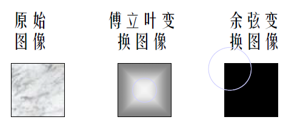

离散余弦变换可以实现为二维图像滤波，系数矩阵即是滤波器核，主要进行乘性运算（对于模拟图像，则先乘以量化矩阵变换为离散数字图像）：

+ 编码：原图像对应像素乘以核（系数矩阵）对应位置值并取整，得到压缩图像；
+ 解码：压缩图像对应像素除以核对应位置值并取整，得到原图像；


下列图像比较清晰的展示了 DCT 后图像的能量集中特征：

+ 保留变化后图像左上角 1x1 像素区域的能量：

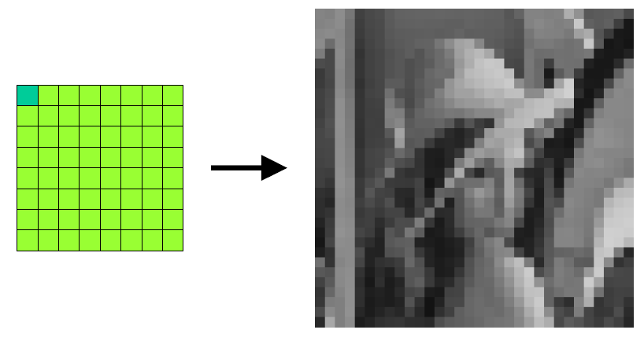

+ 去掉左上角 1x1 区域的能量：

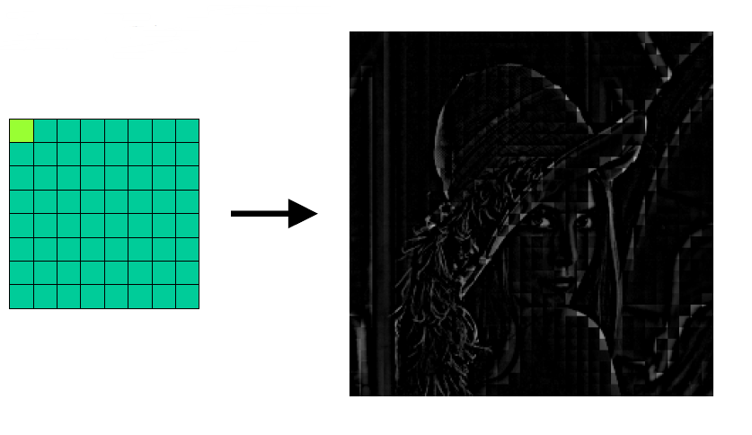

+ 保留第一行水平能量：

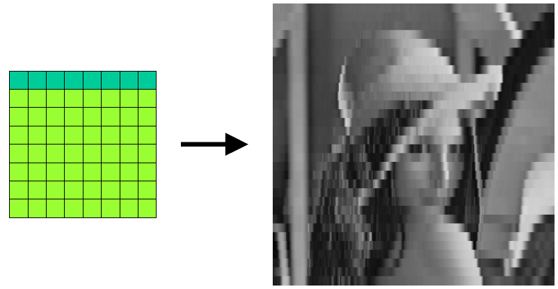

+ 保留第一列垂直能量：

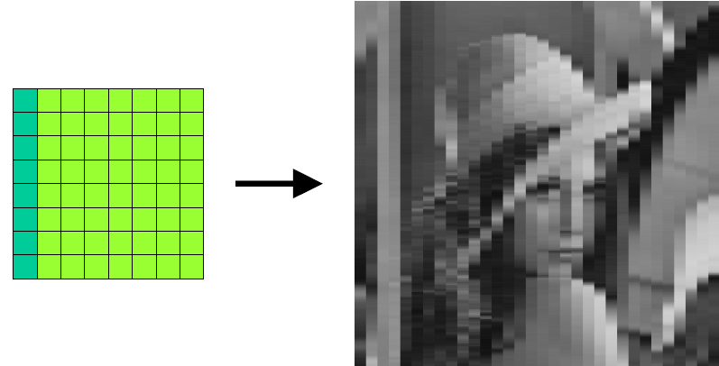

+ 保留对角能量：

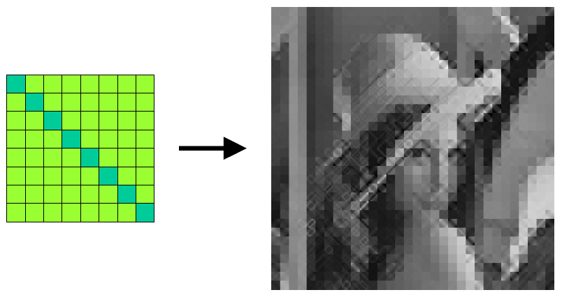

+ 保留 2x2 和 3x3 区域的能量：

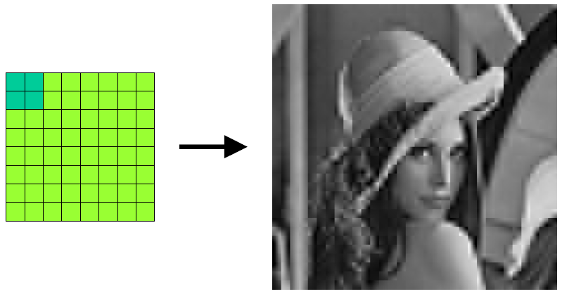

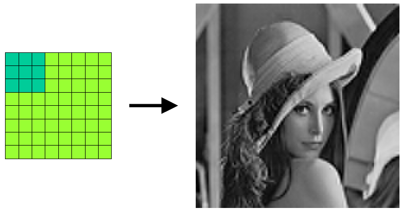

#### 实例研究：JPEG

**JPEG** 图像压缩标准由**联合图像专家组（Joint Photographic Experts Group，JPEG）**和国际标准化组织（ISO）制定，是一种静态连续色调图像的压缩编码标准，包括四种压缩模式：

1. 顺序 DCT 基带模式（sequential DCT-based mode）
2. 渐进 DCT 模式（progressive DCT-based mode）
3. DPCM 无损模式（lossless mode）
4. 分层模式（hierarchical mode）

有损压缩的 JPEG 图像在 1:25 压缩比的情况下几乎无法通过肉眼观察出压缩痕迹，无损 DPCM 压缩从数据损失和压缩比上来看并不成功。因此最常使用的是有损的 DCT 压缩模式，一般将`.jpeg`文件视作**有损压缩**图片格式。

##### JPEG 压缩步骤

JPEG 对原始图像的压缩步骤如下：

1. 将原始图像转**换成 YUV 格式**，4:2:0 采样。如果图像本身为 RGB 格式，则该步骤为可选；
2. 将 Y，U，V 分量分别**分为多个 8x8 的像素块**；
3. 对每个像素块执行**离散余弦（DCT）变换**，并进行**量化**（0~1或 0~255 等）；
4. 对每个量化后的像素块进行 **DPCM 编码**；
5. 采用**“之”字形扫描**方法将二维图像转换为一维标量，并进行**游程编码**；
6. 对一维标量进行**熵编码**（如哈夫曼编码）或算术编码压缩，输出结果。

由于算术编码技术受专业保护，一般第六步多使用哈夫曼编码进行处理。此外，第二步中的 8x8 像素块是实践经验总结后的最优选择，如果分割尺寸小于该尺寸，则分割后像素块过多，导数计算成本上升；如果分割尺寸大于该尺寸，则在图像尺寸较小的情况下，各像素间关联性会降低，影响编码压缩率。

##### 顺序和渐进压缩

JPEG 的顺序压缩模式一次完成对图像的编码和传输，而渐进模式先建立图像概貌再处理细节多次编码压缩，解码时先显示低分辨率图像再显示高分辨率图像，因此接收时可以根据需要在分辨率达标后停止传输以节省带宽。

##### 之字形扫描

在之字形扫描中，使用原点位于左上角的坐标系统，扫描过程可以视作一轮过程的不断循环，该过程可以描述为：

1. 向 x 正方向扫描一格；
2. 向左下方向扫描直到无法继续；
3. 向下扫描一格；
4. 向右上方向扫描直到无法继续；
5. 整个过程不重复扫描像素（回路）。

对图像的扫描持续该过程，直到所有像素都被已经扫描。对于 8x8 的像素块，扫描路径如下：

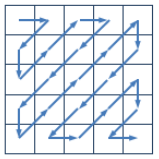

### 1.8 视频编码

视频编码即是对一组连续图像序列进行编码，因此是对图像编码技术的组合运用。由于视频还拥有时间维度，因此可以通过帧间预测编码减少时间冗余进行压缩。

视频压缩主要利用以下三种信号冗余：

+ 空间冗余
+ 时间冗余
+ 视觉冗余

一般来说，视频压缩格式需要满足以下要求：

+ 随机存取：可以读取解析任意时间的信号片段；
+ 快速正向、逆向搜索：信号片段应该能被快速识别；
+ 逆向重播：信号需要能够回退并被再次播放；
+ 视听同步：当视频和音频被封装到同一个文件时，内容应该同步；
+ 低编解码延迟：编解码速度必须足够快。

#### 常用视频编码标准

视频压缩编码算法标准主要由两个国际组织制定：ITU-T（国际电信联盟——电信标准分局）和 ISO（国际标准化组织）制定。目前商业中最常使用的视频编码都是由两者制定，除此之外还有一些较为通用的视频编码标准。

+ H.261，H.263：由 ITU-T 下的 VECG（视频编码专家组）制定；
+ H.264：MPEG-4 第 10 部分，由 ITU-T 和 ISO 下的 MPEG（动态图像专家组）联合制定，使用最为广泛的编码格式之一；
+ H.265：由 ITU-T 和 MPEG 联合成立的 JCT-VC（Joint Collaborative Team on Video Coding）制定，下一代视频编码标准；
+ MPEG：由 ISO 制定；
+ VP8 和 VP9：由 Google 制定；
+ VC-1：由微软制定；
+ AVS 系列：国产编码标准。

#### 运动补偿预测编码

在视频压缩编码技术中，连续图像信号在时间上有着比空间上更大相关系和冗余度，要消除这些冗余，就需要使用预测编码技术进行信号压缩。这种利用帧间空间相关性来减少时间冗余的编码技术被称为**运动补偿预测编码**。运动补偿预测编码是目前使用最广的视频编码方法。

帧间预测一般会将图像画面分成三个部分：

1. 背景区：背景区的大部分像素在相邻两帧中是相同的，具有很大的时间冗余，一般利用参考帧预测目标帧像素；
2. 运动物体区：如果将运动物体的运动看作简单平移，就可以对物体（实际上是物体中的每个像素）的**运动矢量（motion vector，MV）**进行编码，也可以采用某种方式对运动矢量进行“补偿”；
3. 暴露区：暴露区指的是在前一帧被运动物体遮挡，在后一帧因为物体移动显示出来的区域。如果将这部分区域信息预先保存在内存中，就可以在物体移动后直接使用；如果视频进行了场景切换，这部分信息就需要从内存中放弃。

对于**运动物体**，运动补偿预测编码利用上一帧图像中的运动物体信息对下一帧中的运动物体进行预测，将下帧物体实际位置信息与预测信息做差，对该**差值**进行编码传输（DPCM）。前一帧称为**参考帧**，后一帧称为**目标帧**。整个处理过程可以分解为两个子过程：

1. **运动估计（Motion Estimation）**：根据前一帧预测当前帧的运动矢量（方向和位移），如何预测**最优运动矢量**是整个编码技术的关键，主要算法有有像素递归法和块匹配法；
2. **运动补偿（Motion Compensation，MC）**：根据运动估计求出的 MV 找到目标帧像素来自参考帧中的哪个像素，该像素称为预测值，运动估计的最终精度将由运动补偿的精度决定。

##### 像素递归法

**像素递归法**根据像素间亮度的变化和梯度， 通过递归修正的方法来估计每个像素的运动矢量。该方法估计精度高，但解码过程比较耗时，对接收端计算能力要求高，因此实践中较少使用。

##### 块匹配算法

**块匹配算法（Block Matching Algorithm）**是运动矢量预测的最常用的算法。该算法包含以下几个参数：

+ 预测宏块大小：预测块大小需要适当，过大会导致包含多个运动物体，过小会导致没有包含整个运动物体；一般的预测宏块以物体左上角为原点，大小为 16x16，MPEG-1 和 2 标准均采用该大小，H. 264 / MPEG⁃4 AVC 则采用了一种可变大小的宏块划分；
+ 搜索窗口大小：搜索窗口大小需要考虑运动物体的位移大小和计算复杂度，对于一个水平和垂直方向位移位 p 个像素的物体，搜索窗口大小应该为 (2p + 1) x (2p + 1)；
+ 最佳匹配准则：最小均方差（MSE）准则或最小绝对误差均值（MAD，也称 SAD）准则；
+ 搜索方法：穷尽搜索、二维对数搜索、分层搜索、菱形搜索、基于块的梯度下降搜索法等，所有方法都把 MSE 或 MAD 最小的方向矢量视为运动矢量；

块匹配算法本质上是在参考帧的窗口中判断哪一个宏块是目标帧中宏块的运动前/后结果，然后计算其运动矢量。

这些算法同样适用于单个像素点的运动矢量预测，在实践中一般只对宏块预测以节省成本。

###### MSE 和 MAD 准则

最小均方差 MSE 计算公式，其中$f_n(x,y)$为目标帧图像或颜色分量中坐标为$(x,y)$的像素的灰度值，$f_{n-1}(x,y)$为参考帧，$i,j$为宏块中像素在宏块水平和垂直方向上的位移量，$k,l$为宏块左上角相对图像的位移量，$M,N$为预测宏块（一般是正方形）宽高：
$$
MSE(i,j)=\frac{1}{MN}\sum_{x=0}^n\sum_{y=0}^n[f_n(x+k,y+l)-f_{n-1}(x+k+i,y+l+j)]^2
$$
最小绝对误差均值 MAD：
$$
MAD(i,j)=\frac{1}{MN}\sum_{x=0}^n\sum_{y=0}^n|f_n(x+k,y+l)-f_{n-1}(x+k+i,y+l+j)|
$$

当 MSE 或 MAD 最小时，$(i,j)$即是**最优运动矢量**。MAD 实际上就是 MSE 的简化运算版本， 由于进行只加运算而无需乘方运算，计算较为简单，最常使用。

简而言之，MSE 和 MAD 最佳匹配准则在一个指定大小的窗口内，对窗口中的每个宏块中的每个位置相同的目标帧和参考帧像素作差，并求出平均差值。窗口中平均差值最小的宏块最有可能是目标帧宏块的运动结果。

###### 穷尽搜索算法

**穷尽搜索算法（Full Search，FS）**也称**顺序搜索算法**和**全搜索法**，该算法会计算参考帧窗口中的每一个宏块的 MSE 或 MAD，选择值最小的作为 MV。该算法实现简单，但缺点也很明显，算法复杂度达到了 $O(N^2)$ 。

###### 二维对数搜索法

[**二维对数搜索法（Two Dimension Log Search，TDLS）**](https://ieeexplore.ieee.org/document/1094950)将菱形区域作为搜索窗口，每次搜索中心和对角的五个宏块，取 MAD 值最小的点为下次搜索中心。算法过程大致如下：

1. 使用菱形对角线长度按照公式计算**搜索步长**，在五个点中寻找 MAD 值最小的宏块，该宏块称为运动矢量的**近似**；
2. 如果近似宏块原点（一般为左上角）不是菱形区域中心点，则将该点作为下一次搜索的菱形区域中心，继续寻找五个点中 MAD 值最小的宏块；
3. 如果近似点是菱形区域**中心点**或图像**边界点**，说明最佳近似点位于区域内，此时根据公式计算下次步长（步长非整数则向上取整），继续寻找缩小后区域的五个点中 MAD 值最小的宏块；
4. 如果步长已经**缩小为 1**，则搜索周围所有 9 个宏块；
5. 重复步骤直到精度满足要求。

其中步长计算公式为（`Step`为步长，`p`为菱形对角线长度）：
$$
Step=2^{\lfloor\frac{\log_{10}(p+1)}{\log_{10}2}\rfloor-1}
$$
下面是一个例子：

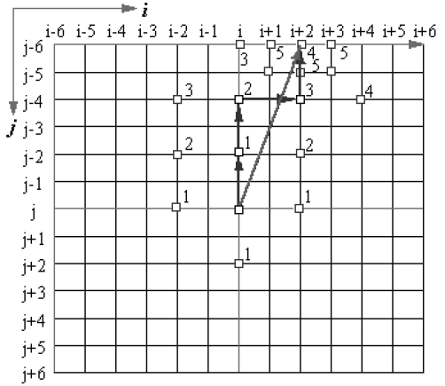

###### 三步搜索法

**三步搜索法（Three Step Search，TSS）**因其单次搜索迭代中只有三步得名，因为算法运算简单而经常使用。三步搜索实际上是将搜索窗口宏块不断缩小的过程，分为以下三步：

1. 以窗口大小一半为**搜索步长**，在窗口中搜索 MAD 值最小的宏块，该像素称为运动矢量的**一级近似**；
2. 以一级近似宏块原点（一般为左上角）为窗口中心，搜索步长变原来一半（步长非整数则向上取整），继续寻找 MAD 最小宏块，称为**二级近似**；
3. 以二级近似宏块原点为窗口中心，搜索步长变原来一半（向上取整），寻找 MAD 最小宏块，即是**最佳近似**宏块。

三步搜索可以多次迭代使用，以前一次得出的最佳近似点为窗口中心再次进行三步搜索，直到精度满足要求。

下面是一个单次三步搜索的例子，初始搜索窗口大小为 6，假设一级近似宏块原点为 $(i+3,j+3)$ ，二级近似宏块原点为 $(i+3,j+5)$ ，最佳近似为 $(i+2,j+6)$ ：

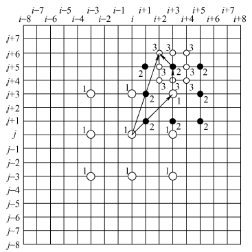

###### 分层搜索算法

分层搜索算法采取先在低分辨率图像中搜索初级近似，再在高分辨率图像中搜索高级近似的策略，减少每一步搜索的运算成本，该过程将涉及图像缩放算法。

#### 实例研究：MPEG-1

于 1993 年 8 月推出的 MPEG-1 编码标准是 MPEG 家族的第一个标准，由 ISO/IEC 制定，标准号为 ISO/IEC 11172 。MPEG-1 标准包括五个部分：

1. MPEG-1 系统（MPEG-1 Systems）：规定视频数据、声音数据及其他相关数据的同步合成技术；
2. MPEG-1 视频编码标准（MPEG-1 Video）；
3. MPEG-1 音频编码标准（MPEG-1 Audio）；
4. MPEG-1 一致性测试：详细说明如何测试比特数据流和解码器是否满足 MPEG-1 前 3 个部分中所规定的要求；
5. MPEG-1 软件模拟：一个技术报告，给出了软件执行 MPEG-1 前 3 个部分的运行结果。

MPEG-1 标准的使用是免费的，而之后的 MPEG 标准都需付费授权。经典的 MPEG-1 标准如今已很少见，其中一个原因是因为 MPEG-1 没有考虑网络传输需求，其架构相比其他现代编码不适用于网络传输。

##### MPEG-1 架构

MPEG-1 自顶向下将单个视频文件分为六层：

1. 图像序列层：图像序列层将整个视频文件分为多个图像组，在视频头部和尾部附加一个图像序列头和图像序列尾，序列头包含以下首部字段：
   + 32 bit 序列头码
   + 12 bit 图像水平大小
   + 12 bit 图像垂直大小
   + 4 bit 像素长宽比
   + 4 bit 图像传输速率（比特率）
   + 4 bit 位码率
   + 32 bit 结束码
2. 图像组层：图像组分为多幅图像，在组头部和尾部附加一个组头和组尾；
3. 图像层：MPEG-1 图像层中的图像帧采用 YUV 4:2:0 方式采样和量化，每幅图像可能是 I、P、B、D 图像中的任意一种，被分为多个宏块片，图像同样包含图像头和图像尾；
4. 宏块片层：宏块片包含多个宏块，具有宏块片头和片尾；
5. 宏块层：每个宏块大小为 16x16 像素；
6. 像素层：YUV 格式的像素。

##### MPEG-1 压缩技术

MPEG-1 的帧内图像编码采用了 JPEG 格式，帧间编码使用宏块大小为 16x16 的双向运动补偿技术，因此图像层的帧图像被分为了四种类型：

+ I 帧：节点编码图像（intra coded picture），作为参考帧存在，仅进行帧内编码，一般会隔 0.5 秒 插入一个 I 帧来避免预测误差过大；
+ P 帧：预测编码图像（predictive coded picture），由之前的 I 帧或 P 帧前向预测得到并编码；
+ B 帧：前后预测编码图像（bidirectionally predictive coded pictures），和 P 帧类似，但是还进行后向预测；
+ D 帧：指示编码图像（direct coded picture），用于快速进带倒带，可在比特率低的时候用于浏览，只进行了量化编码，实践中很少会使用。

由于使用了双向编码，B 帧在传输时的顺序不能与编码时相同，因为在之后的 I 或 P 帧到达前 B 帧无法进行解析。因此，发送端会考虑先发送 I 帧和 P 帧，然后发送 B 帧：

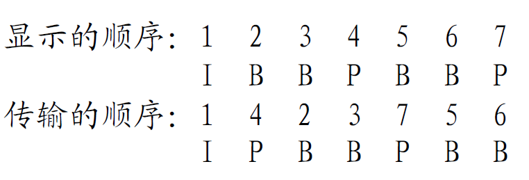

## 二、音频编码

### 要点

+ 数字音频的编码和存储方式
+ Microsoft Wave 格式

### 2.1 数字音频编码概述

模拟声音信号与光电信号不同，是一种典型的机械波，来源于物体振动。声音信号包含三个基本要素：

1. **振幅**：即物体振动的幅度。振幅越大，能量越强，音量越高；
2. **频率**：即物体每秒振动次数，单位**赫兹（Hz）**。声音频率越高，音调越高，声音越加尖锐；
3. **音色**：音色是一种主观描述。模拟声音信号不仅包含单一频率的声音，而是由多频率的各种信号复合而成。强度最大的频率分量称为**基音**，其他声音分量称为**泛音**，后者决定了声音的音色。

### 2.2 数字音频信号的采样和量化

在数字音频信号技术出现前，记录模拟声音信号常用的技术有卡式磁带和唱片，卡式磁带因为其固有缺点已接近淘汰。**唱片**通过将声音信号以纹路槽的形式刻录在唱片表面，在播放时通过唱针在唱片表面滑动读取信号，并通过其他设备还原播放，声音品质接近原生，听觉失真较小。唱片因为其高还原的特性仍占有较大市场，但是具有保养成本大和难以分发的问题。

数字音频信号和其他数字信号一样，需要经过**采样**和**量化**两个步骤进行数模转换，即使用 PCM 技术。对声音信号的通信模型可以解释为：

1. 信源采样：获取声音信号并进行数模转换；
2. 信号预处理：以压缩和修正等方式处理数字音频信号；
3. **信源编码**：对音频信号编码，降低数据冗余度和传输带宽；
4. **信道编码**：以流的方式封装声音各部分以适应现代网络通信环境；
5. **信道编码**：对信号各部分按照一定通信协议进行封装，目的是使图像视频信号**更适合在本地或网络环境中进行传输**，如 WebRTC 是一种适用于实时视频通信的因特网应用层协议；
6. 调制，传输和解调：将数字信号转化为模拟信号后在信道中传输，并在接收端解调为数字信号；
7. **信道解码**：信道编码逆过程；
8. **信源解码**：信源解码逆过程；
9. **信源解析**：播放解码后的数字声音信号。

一个未经压缩和其他处理的原始数字声音信号的容量计算公式：
$$
声音比特数=采样频率\times量化位数\times声道数\times单个采样持续时间\ /\ 8
$$
根据奈奎斯特采样定理，声音信号的采样频率也应该超过最高频率分量的两倍以上。由于人耳的频率识别范围为 20 Hz ~ 20 kHz，常用的声音采样频率为 44.1 kHz，量化位数则使用 8 bits。

### 2.3 适用于声音信号的 PCM 编码格式

适用于声音信号的 PCM 技术在采样中使用非平均量化。在 PCM 编码方式的一种：A 律 13 折线法中，会将采样信号 8 等分，然后进行量化区间拉伸和缩放。函数图像如下：

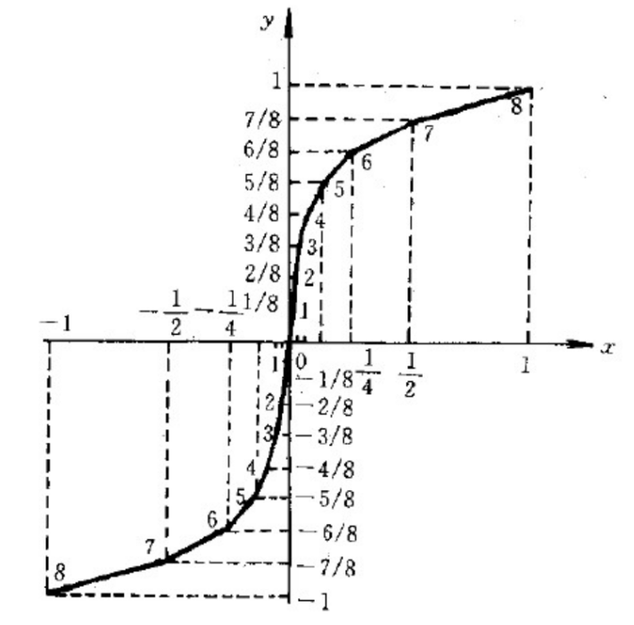

因为在归一化区间中总共有 13 段折线，该方法被称作 13 折线法。

PCM 将量化位分为三部分：

1. **极性码**：记录码字表示的强度正负，0 为正，1 为负，占 1 位；
2. **段落码**：记录码字在 8 等分区间中所处位置，，占 3 位；
3. **段内码**：记录码字的频率具体取值，对于 8 bits 量化位数，占据剩下 4 位，可表示 16 个频率区间。

| 归一化量化范围 | 斜率 | 段落码 |
| -------------- | ---- | ------ |
| 0 ~ 1/128      | 16   | 000    |
| 1/128 ~ 1/64   | 16   | 001    |
| 1/64 ~ 1/32    | 8    | 010    |
| 1/32 ~ 1/16    | 4    | 011    |
| 1/16 ~ 1/8     | 2    | 100    |
| 1/8 ~ 1/4      | 1    | 101    |
| 1/4 ~ 1/2      | 1/2  | 110    |
| 1/2 ~ 1        | 1/4  | 111    |

PCM 是一种没有经过压缩的格式，除了 8 位量化还常使用更高精度的 16 位量化。PCM 数据的排列顺序：

1. 采样 1：
   1. 声道 1
   2. 声道 2
   3. 声道 3
   4. ......
2. 采样 2
3. 采样 3
4. ......

PCM 每次采样的样本称为 PCM 帧（PCM Buffer），PCM 帧大小的计算公式为：
$$
帧大小(字节)=采样率\times采样时间\times采样位数\times通道数 \div 8
$$


## 三、多媒体文件容器

### 要点

+ 多媒体文件容器
+ Microsoft RIFF
+ Microsoft AVI

### 3.1 多媒体文件概述

音频和视频信号都有各自的压缩编码标准，这些信号在编码后产生的数据流称为基本流（Elementary Stream）。一路基本流中只包含一路媒体数据，而现实中的多媒体文件（如视频）一般会包含多路媒体流。为了能够同步不同标准下的基本流，将多路媒体流复用到同一个文件或数据流中，就需要以一种能够将将多路流进行组装的**文件容器格式（File Container Format）**，多路复用的文件或数据流则称为**多媒体文件容器**。

目前常见的多媒体文件封装格式有：

+ FLV：由 Adobe 公司制定，适用于网络流传输，`.flv`；
+ MPEG-TS：最初在 MPEG-2 标准中制定的传输流（Transporting Stream）格式，在 HTTP 实时流协议（HLS）中常用，`.ts`；
+ MP4：目前使用最广的媒体格式，支持 H264 和 H265 等多个视频编码标准，`.mp4`；
+ MKV：一种开源的封装格式，`.mkv`；
+ AVI：微软音视频交错（Audio-Video-Interleaved）格式，适用于本地场景，也常用于光盘和其他移动存储媒介场景，`.avi`；
+ 3GP：主要用于以前的 3G 移动通信场景；
+ OGG：一种完全免费、开放和没有专利限制的封装格式。

### 3.2 Microsoft RIFF

微软资源互换文件格式（Resources Interchange File Format，**RIFF**）是一种树状数据结构，由节点（LIST）和叶子（CHUNK）组成，和 Windows 的文件系统结构十分类似。RIFF 包含以下数据结构：

+ FOURCC：四字符（four character code）是一个 4 字节字符串，RIFF 中的许多字段都是一个 FOURCC；

+ CHUNK：数据块是 RIFF 中的叶子，类似 Windows 文件系统中的文件，是最基础的类型。CHUNCK 可以包含多种信息，如多媒体元数据、采样信号数据等。每个 CHUNK 包含三个或更多的字段：

  + `ChunkID`：块的名字，有`RIFF`、`fmt`和`data`，只能有一个该字段；
  + `ChunkSize`：块的大小，小端序，只能有一个该字段；
  + `ChunkData`：块中的数据，可以有任意多个该字段。

+ LIST CHUNK：列表是 RIFF 中的节点，属于一种 CHUNK，类似 Windows 文件系统中的目录（文件夹），LIST CHUNK 包含以下部分：

  | 字段       | 字段类型            | 解释                                                        |
  | ---------- | ------------------- | ----------------------------------------------------------- |
  | `"LIST"`   | `ChunkID`，FOURCC   | 固定值的字符串，表示这是一个 LIST CHUNK。                   |
  | `ListSize` | `ChunkSize`         | LIST CHUNK 的大小，不包括`ListSize`和`"LIST"`字段，小端序。 |
  | `ListType` | `ChunkData`，FOURCC | 表示 LIST 的类型。                                          |
  | `ListData` | `ChunkData`         | LIST 的数据区域，可能包含更多的 CHUNK 和子 LIST。           |
  
+ RIFF CHUNK：所有 RIFF 容器都以一个 RIFF CHUNK 开始，包含以下部分：

  | 字段       | 字段类型            | 解释                                                 |
  | ---------- | ------------------- | ---------------------------------------------------- |
  | `"RIFF"`   | `ChunkID`，FOURCC   | 固定值的字符串，表示这是一个 RIFF CHUNK。            |
  | `FileSize` | `ChunkSize`         | 文件的大小，不包括`FileSize`和`"RIFF"`字段，小端序。 |
  | `FileType` | `ChunkData`，FOURCC | 表示 RIFF 容器的类型。                               |

### 3.3 Microsoft AVI

微软音视频交错（Audio-Video-Interleaved，**AVI**）格式是 Windows 平台下常用的音视频文件封装格式，同时支持文字流封装，是 RIFF 的一个子集。其格式适用于本地环境传输和解析，在网络环境中使用有限。

AVI 文件包含 6 个部分：

1. `RIFF`CHUNK（文件头）：只能有一个；
2. `hdrl`LIST：只能有一个；
3. `info`LIST：只能有一个；
4. `junk`CHUNK：可以出现在各种 LIST 中用于对齐；
5. `movi`LIST：只能有一个；
6. `idx1`CHUNK：只能有一个。

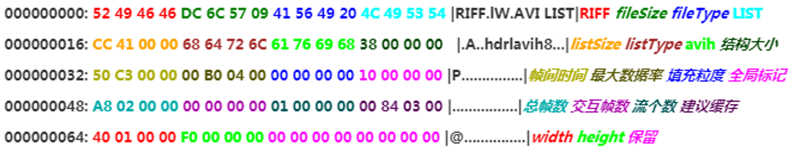

#### `RIFF`CHUNK

  RIFF 块记录了 AVI文件的基本信息：文件大小和文件类型。

| 字段名 | 块内偏移 | 大小（字节） | 端序   | 值                                                      |
| ------ | -------- | ------------ | ------ | ------------------------------------------------------- |
| ID     | `0x00`   | 4            | Big    | `"RIFF"`，`0x52494646`                                  |
| Size   | `0x04`   | 4            | Little | 文件实际大小 - 8（不包括 RIFF 块的 ID 和 Size 字段）    |
| Type   | `0x08`   | 4            | Big    | `"AVI "`（一个 FOURCC，最后一位空格填充），`0x41564920` |

#### `hdrl`LIST

HEADER LIST 作为 AVI 的文件头记录了各种媒体元数据信息。该 LIST 包含多个`ListData`部分。

| 字段名     | 大小（字节） | 值                                   |
| ---------- | ------------ | ------------------------------------ |
| `"LIST"`   | 4            | `"LIST"`，`0x4C495354`               |
| `ListSize` | 4            | HEADER LIST 实际大小 - 8             |
| `ListType` | 4            | `"hdrl"`，`0x6864726C`               |
| `ListData` |              | 表头 CHUNK，`avih` CHUNK，`strl`LIST |

##### 表头 CHUNK

HEADER LIST 的表头，三个字段的值：`LIST`，`HEADER LIST 实际大小 - 8`，`"hdrl"`。

##### `avih`CHUNK

AVI HEADER 块描述主要的 AVI 元数据信息。

| 字段名              | 大小（字节） | 端序   | 值                                                      |
| ------------------- | ------------ | ------ | ------------------------------------------------------- |
| ID                  | 4            | BIG    | `"avih"`，`0x61766968`                                  |
| ChunkSize           | 4            | Little | AVI HEADER CHUNK 实际大小 - 8                           |
| MicroSecPerFrame    | 4            | Little | 显示每帧所需的微秒数                                    |
| MaxBytesPerSec      | 4            | Little | 最大字节率                                              |
| PaddingGranularity  | 4            | Little | 填充粒度，每个记录块的长度必须为粒度的倍数，一般为 2048 |
| Flags               | 4            | Little | 标志位                                                  |
| TotalFrames         | 4            | Little | 视频总帧数                                              |
| InitialFrames       | 4            | Little | 开始播放前需要缓存的最小帧数                            |
| Streams             | 4            | Little | 文件中的数据流数量                                      |
| SuggestedBufferSize | 4            | Little | 建议的缓冲区大小                                        |
| Width               | 4            | Little | 视频宽度                                                |
| Height              | 4            | Little | 视频高度                                                |
| Reserved            | 4            |        | 保留字节                                                |

##### `strl`LIST

Stream Info LIST，可以有多个，数量和容器中的媒体流数量对应，记录了每个流的元信息。每个 Stream Info LIST 包含以下部分：

+ `strh`CHUNK：每条流信息的头部；
+ `strf`CHUNK：每条流的具体格式信息；
+ `strd`CHUNK：可选的额外头部信息；
+ `strn`CHUNK：可选的流的名字；
+ `vprp`CHUNK：每条流的其他属性。

#### `info`LIST

Info Tags LIST 记录了一组额外的标签信息，包含一个表头和一组标签。常见的标签项有：

+ Director：视频导演
+ Recorded Date：录制时间
+ Title：标题
+ Comment：附加注释文字

#### `junk`CHUNK

Garbage CHUNK 是用于数据对齐的无用块，无需解析。

#### `movi`LIST

Datas LIST 包含了所有媒体流的采样二进制数据，这些数据均为一个 CHUNK 。数据 CHUNK 有以下几种类型：

+ `db`：未压缩的视频帧；
+ `dc`：压缩的视频帧；
+ `wb`：未压缩的音频帧；
+ `wc`：压缩的音频帧；
+ `pc`：调色板信息，出现该 CHUNK 表示接下来需要在渲染时改用其内部的颜色信息。

每个数据 CHUNK 的名称为`<序号><类型>`，如`01wb`表示第二个未压缩的音频帧。序号用作索引以实现随机存取。

#### `idx1`CHUNK

Index CHUNK 是为了加速随机存取和进倒带的索引块

### 3.4 Microsoft  Wave

  WAVE 音频文件（`.wav`）是微软 RIFF 标准的一个子集，用于封装各种编码格式的音频文件。其格式适用于本地环境传输和解析，在网络环境中使用有限。

  典型的 WAVE 格式：


  WAVE 包含三个的 RIFF CHUNK：`RIFF`、`fmt`和`data`。

  #### `RIFF` CHUNK

 RIFF 块（WAVE 头）记录了 WAVE 文件的基本信息：文件大小和文件类型。

  | 字段名 | 块内偏移 | 大小（字节） | 端序   | 值                                                   |
  | ------ | -------- | ------------ | ------ | ---------------------------------------------------- |
  | ID     | `0x00`   | 4            | Big    | `"RIFF"`，`0x52494646`                               |
  | Size   | `0x04`   | 4            | Little | 文件实际大小 - 8（不包括 RIFF 块的 ID 和 Size 字段） |
  | Type   | `0x08`   | 4            | Big    | `"WAVE"`，`0x57415645`                               |

  #### `fmt` CHUNK

  FORMAT CHUNK 记录了 WAVE 音频的其他信息。

| 字段名        | 块内偏移 | 大小（字节） | 端序   | 值                                                           |
| ------------- | -------- | ------------ | ------ | ------------------------------------------------------------ |
| ID            | `0x00`   | 4            | Big    | `"fmt"`，`0x666D7420`                                        |
| Size          | `0x04`   | 4            | Little | 块实际大小 - 8                                               |
| AudioFormat   | `0x08`   | 2            | Little | 音频编码格式，常见的 PCM 格式的值为`1`                       |
| NumChannels   | `0x0A`   | 2            | Little | 声道数                                                       |
| SampleRate    | `0x0C`   | 4            | Little | 采样频率                                                     |
| ByteRate      | `0x10`   | 4            | Little | 每秒字节数，`SampleRate * NumChannels * BitsPerSample / 8`   |
| BlockAlign    | `0x14`   | 2            | Little | 块内对齐，表示每个采样的大小，`NumChannels * BitsPerSample / 8` |
| BitsPerSample | `0x16`   | 2            | Little | 每个采样的量化位数，一般为 8，16，32                         |

  #### `data` CHUNK

DATA CHUNK 记录了音频信号的采样值。

| 字段名 | 块内偏移 | 大小（字节）             | 端序   | 值                           |
| ------ | -------- | ------------------------ | ------ | ---------------------------- |
| ID     | `0x00`   | 4                        | Big    | `"data"`，`0x64617461`       |
| Size   | `0x04`   | 4                        | Little | 块实际大小 - 8               |
| Data   | `0x08`   | 任意，一般不会超过`2^32` | Little | 特定编码格式的二进制采样数据 |

## 附录

### MediaInfo

MediaInfo 是一个在 Windows 、Mac OS X 、Linux 、iOS 、Android 平台中可用的媒体文件元信息解析器。

[官方网站](https://mediaarea.net/en/MediaInfo)

### MediaCouch

MediaCouch 是一个开源的多平台多功能多媒体工具，包含媒体文件解析和修复等功能，可用于云计算场景。

[官方网站](https://mediaarea.net/MediaConch)
