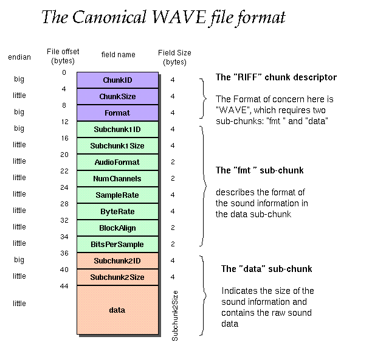

# 数字音视频信号技术

## 一、视频和图像编码

### 要点

+ 图像视频压缩的概述和目的
+ 数字视频色彩空间
  + **YUV** 和其采样

+ 彩色电视制式
+ 熵编码
  + **编码效率**
  + **哈夫曼编码**
  + **算术编码**

+ 预测编码
  + **DPCM 概述**
  + **MV 二维对数搜索算法**

+ 变换编码
  + **DCT 的性质**

+ 现代视频格式
+ JPEG
+ MPEG
+ H.264 和 NAL

### 1.1 图像视频编码概述

数字视频信号是在采集过程中，通过对模拟信号进行采样和量化后获得的。未经过压缩的初始视频信号所需要的存储空间为：
$$
视频比特数=采样频率\times 量化位数\times 视频宽\times 视频高\times 帧率\times 时间
$$
没有压缩过的原始视频体积一般较大，不符合传输要求，因此，要利用信号本身的一些对原始信号进行压缩和编码。现代网络视频编码不仅要求能够减少视频体积，还要求视频能够便于在网络中按照特定协议进行传输，并且能够被快速解析。

一张图说明近年音视频编码发展历史：


### 1.2 信号冗余

一般的，信号在频率域和时域上存在一些冗余。对于视频和图像信号，有：

+ 空间冗余：图像内容各部分有很大相似性，如蓝天背景；
+ 时间冗余：相邻的两帧图像间部分或全部区域相似，或者完全一致，如一段静物景象；
+ 结构冗余：图像部分符合特定模式重复出现，如纹理；
+ 编码冗余：也称符号冗余，图像编码中存在信息冗余，可以用香农熵理论进行解释；
+ 视觉冗余：人眼对图像的感知是非均匀和非线性的，对图像各部分的敏感度不同，一些图像细节不需要较高分辨率；
+ 知识冗余：在一些特定场合中，视频信号中的信息与某些先验知识相关，如人的五官相对位置，可以对这些知识进行建模。

### 1.3 通用视频中间格式

视频信号传输技术最早被使用在电视产业中，为了保证工业上的标准性，业界定制了一些被称为通用中间格式（Common Intermediate Format，CIF）的格式标准。这些标准规定了视频的大小格式，而不是编码格式。

在传统数字电视系统中，国际电报电话咨询委员会（CCITT）规定了：

+ SQCIF：128x96
+ QCIF：176x144
+ CIF：352x288
+ 4CIF：720x576

现代通用视频标准有：

+ SD：标清，480p，720x576
+ HD：高清，720p，1280x720
+ FHD：全高清，1080p，1920x1080
+ UHD：超高清，4K，3840x2160
+ FUHD：全超高清，8K，7680x4320

### 1.4 彩色电视制式

传统电视系统中有三种常用的彩色电视制式：NTSC，PAL，SECAM 。

#### 隔行扫描

和现代网络视频不同，传统电视信号大多使用**隔行扫描（interlaced scanning）**技术。电视信号在输出时，首先输出所有奇数行的信号，再输出偶数行信号，人眼难以察觉到信号输出间的延迟，因此视频图像可以更快的显示在屏幕上。一般使用隔行扫描输出的视频格式会在尾部加上字母 i ，如 1080i 表示隔行扫描的全高清视频。

#### NTSC

NTSC(National Television Systems Committee)彩色电视制是 1952 年美国国家电视标准委员会定义的彩色电视广播标准，称为正交平衡调幅制。NTSC 的特点有：

+ 每帧 525 行，帧率 29.97 fps ；
+ 电视纵横比 4:3，电影 3:2 ，高清电视 16:9 ；
+ 隔行扫描；
+ 颜色模型使用 YIQ 。

#### PAL

由于 NTSC 存在相位敏感造成彩色失真的缺点，联邦德国在 1962 年制定了 PAL(Phase-Alternative Line) 电视标准，这也是我国老一代有线电视网使用的标准电视制式。PAL 的特点有：

+ 每帧 625 行，帧率 25 fps；
+ 纵横比 4:3；
+ 隔行扫描；
+ 颜色模型使用 YUV 。

####  SECAM

SECAM 是由法国、俄罗斯和一些东欧国家使用的电视制式，图像格式为 4:3，625 线，50 Hz，6 MHz 电视信号带宽，总带宽8 MHz。SECAM 的特点有：

+ 每帧 625 行，帧率 25 fps
+ 纵横比 4:3，720 x 576；
+ 隔行扫描；
+ 颜色模型使用 YCbCr 。

### 1.5 颜色模型

#### YUV

在视频编码中，最常使用的颜色模型是 YCrCb 模型，该模型来源于经典的 YUV 模型，工业上一般直接称为 **YUV 颜色模型**。该模型采用亮度 + 色度的方式表示像素块颜色，其中 **Y** 表示亮度分量，**U（Cb）**表示蓝色色度分量，**V（Cr）**表示红色色度分量。

YUV 及其变种的应用领域：

+ YIQ：NTSC 制式的颜色模型；
+ YUV：PAL 和 SECAM 制式的颜色模型；
+ YCbCr：老式 CRT 显示器和现代视频压缩标准（JPEG，MPEG，H.26X 等）常用的颜色模型，应用最广的经典 YUV 变种。

由于人眼对亮度信息的敏感度要高于色度信息，利用该视觉冗余特性，YUV 适当降低了色度分量的采样率，因此减少了传输带宽并不会对图像质量产生太大影响。YUV 主要有四种采样格式：4:4:4，4:2:2，4:2:0，4:1:1 。

##### 4:4:4 采样

以 PAL 制式为例，4:4:4 方法按以下方式采样：


即对于每个像素，都进行 YUV 分量的采样。

##### 4:2:2 采样

以 PAL 制式为例，4:2:2 方法按以下方式采样：


即在每行中，间隔两个像素进行一次 UV 采样（取两个像素的 UV 平均值），而对每个像素都进行 Y 采样。

##### 4:1:1 采样

以 PAL 制式为例，4:1:1 方法按以下方式采样：


即在每行中，间隔四个像素进行一次 UV 采样（取四个像素的 UV 平均值），而对每个像素都进行 Y 采样。

##### 4:2:0 采样

以 PAL 制式为例，4:2:0 方法按以下方式采样：


和 4:1:1 不同，4:2:0 对 UV 分量的采样是跨行的，即取一个 4x4 像素空间的 UV 平均值。

#### RGB

**RGB 模型**主要针对彩色显示器和摄像机设计，使用红绿蓝三原色表示其他所有颜色。RGB 图像实际是包含红绿蓝三个**分量**的三幅灰度图像的**叠加**结果，三幅颜色平面在内存中存储使用的比特数称为像素**深度**，**全彩色图像**指一幅 **24 比特**的 RGB 图像，总共可以表示 (2^8^)^3^ = 16777216 种颜色。

RGB 模型和 HSI 模型的关系是：

+ H：将颜色表示为扇面模型，色调角度和所处的扇面区域有关，从 0~120 度为 RG 扇面，120~240 为 GB 扇面，240~360/0 为 BR 扇面
+ S：饱和度和 RGB 中某一颜色分量在所有分量和中的占比相关，`R|G|B / R+G+B`的值越高，饱和度越高
+ I：亮度和 RGB 三个分量的和相关，和的值越高，亮度越高

#### CMY 和 CMYK 模型

**CMY/CMYK 模型**针对打印设备开发，使用二次色青、品红、黄色作为三原色。因为 CMY 实际上可以描述为白光减去 RGB，RGB 转换为 CMY 的公式很简单：
$$
[C,M,Y]=[1,1,1]-[R,G,B]
$$
也可以理解为 C 不反射红色，M 不反射绿色，Y 不反射蓝色。实际印刷中，由于颜料纯度的原因，将 CMY 混合印刷黑色的结果可能是一种不纯的棕色，因此 CMYK 加入了新的分量 **K** 代表黑色的值。K 的取值为 CMY 分量中的**最小值**。

从 CMY 到 CMYK 的公式为：
$$
K=min(C,M,Y) \\ C=(C-K)/(1-K) \\ M=(M-K)/(1-K) \\ Y=(Y-K)/(1-K)
$$
从 CMYK 到 CMY 的公式为：
$$
C=C(1-K)+K \\ M=M(1-K)+K \\ Y=Y(1-K)+K
$$
CMYK 模型和 HSI 模型的关系：

+ H：和颜色所处的扇面区域有关
+ S：和 CMY 的和的值相关，和越高饱和度越高；K 首先和 S 无关，但在黑色的纯度变高时，K 值上升
+ I：亮度与 K 相关，黑色越多，亮度越低

#### HSI 模型

虽然 RGB 和 CMYK 很适合硬件和软件实现，但不利于描述人眼的主观感知，因此提出了 **HSI 模型**。HSI 使用**色调（Hue）**、**饱和度（Saturation）**、**亮度/强度（Intensity/Brightness）**描述颜色。其中色调用于描述一种**纯色**的光谱特性，饱和度描述被**白光稀释**的程度，亮度是主观描述子，但可以认为是混入黑色的量。

HSI 的好处是可以**分离**亮度与色彩信息，因为亮度是一种消色（与颜色无关）的特性，因此 HSI 被广泛用于图像处理领域。三者的单位分别是：

+ H：角度，HSI 颜色模型可以被描述为圆形或三角形模型（p289），规定规定颜色点到圆心的连线与**纯红色线条**组成的夹角是 H 的角度值 **θ** 
+ S：百分比，为点到`圆心的连线长度/圆形模型半径`的值
+ I：百分比，在 RGB 到 HSI 的转换中，将 RGB 值归一化处理，`1/3 * (R + G + B)`就是 I 的值，即颜色能量强度

#### Lab 模型

**Lab 模型**是一种**设备无关**的颜色模型，通常用于不同设备间的颜色沟通，不能被直接解释。为了让 Lab 模型能够被设备直接显示，各设备一般会配置一张其使用的颜色模型与 Lab 的**映射表**。Lab 包含了整个可见光谱的颜色，三个分量分别表示：

+ L：亮度
+ a：红色减去绿色
+ b：绿色减去蓝色

与其他模型相比，Lab 的亮度与颜色的**分离度**更大，因此是一种极好的亮度颜色解耦器。

### 1.6 PCM 脉冲编码调制

**脉冲编码调制（Pulse Code Modulation，PCM）**是数字通信技术的基础，用于将模拟信号转换为数字信号，最早于 1937 年由 A·弗里斯提出，在 20 世纪 70 年代迅速发展。

PCM 将连续模拟信号转换为离散二进制数字信号，经历三个过程：取样、量化和编码。

#### 取样

**取样**也称采样或抽样，通过对模拟信号进行周期（称为**采样频率**）性扫描，把时间上连续的信号变成时间上离散的信号，采样过程需要遵守奈奎斯特采样定理：信号的采样频率必须超过最高信号频率的 2 倍，否则将产生信号混叠并导致失真。

#### 量化

量化即是将采样结果离散处理，将一段连续区间内的所有模拟信号频率归于同一个离散值，一般使用二进制表示量化结果。量化结果和采样结果间的误差称为量化误差，在信号接收端将表现为噪声。为了减少噪声数量，一般采用**非均匀量化**（对不同能量区间进行拉伸或收缩）方法。非均匀量化的优点是可以减少甚至放弃出现概率小的信号范围的量化位数，分配更多的量化位数给出现概率更大的信号范围。

#### 编码

**编码**是使用有特定格式的二进制数据表示一个连续模拟信号离散值的过程，由于量化和编码通常是同时进行的，编码也被称为模数转换（A/D）。

### 1.7 图像编码

和其他通信技术类似，视频图像通信技术也有通用的描述模型。对于视频图像信号，该模型各步骤可以概括和解释为：

1. 信源采样：获取图像视频信号，将模拟信号转换为数字信号；
2. 信号预处理：使用数字图像处理技术处理未压缩的像素位图；
3. **信源编码**：对图像信号内容进行编码，目的是减小图像信号冗余度以**降低传输带宽**，如 JPEG 编码能够减少图片大小；
4. **信道编码**：对信号各部分按照一定通信协议进行封装，目的是使图像视频信号**更适合在本地或网络环境中进行传输**，如 WebRTC 是一种适用于实时视频通信的因特网应用层协议；
5. 调制，传输和解调：将数字信号（基带信号）调制为模拟信号（频带信号）后在信道中传输，并在接收端解调为数字信号；
6. **信道解码**：信道编码逆过程；
7. **信源解码**：信源解码逆过程；
8. **信源解析**：将解码后的图像视频渲染到设备。

#### 图像压缩编码类型

图像压缩编码分为有损压缩和无损压缩两类：

+ **无损压缩**：压缩和解压不会损伤原始信号，相比有损压缩压缩率较低，常见的有 TIF、BMP、GIF、PNG 格式等，一般采用预测和熵编码；
+ **有损压缩**：压缩过程舍弃了部分原始信号，比无损压缩效率更高，一般采用变换和量化编码方法。

#### 熵编码

熵，即**香农熵（Shannon Entropy）**，是指信源中所含**平均信息量**进行无失真压缩编码的理论极限。熵编码是一类无损编码。

##### 编码效率评估

**信息量**描述的是信源中各个符号出现的不确定性。对于每个出现概率为 p(x~i~) 的符号 x~i~，其信息量 I(x~i~) 计算公式为：
$$
I(x_i)=-\log_2{p(x_i)}
$$
**信息熵** H(X) 则是信源中各个符号不确定度的数学期望，单位比特/符号，表达的是信源中每个符号的平均信息量：
$$
H(X)=\sum_{i=1}{p(x_i)I(x_i)}=-\sum_{i=1}{p(x_i)\log_2p(x_i)}
$$

由于信息熵表示信源中符号平均信息量，可以用其计算编码后的存储空间效率。首先需要计算**平均码长** $\overline{K}$，$K_i$为第`i`个字符的长度：
$$
\overline{K}=\sum_{i=1}{p(x_i)K_i}
$$
**编码效率 η** 则为：
$$
η=H(x)/\overline{K}
$$

##### 游程编码

**游程编码**，也称**行程编码（Run Length Encoding，RLE)**，是一种最简单的熵编码。游程编码将二维图像转为一维描述，使用符号 + 计数的方式描述一串信号，如`aaaa bbb cc d eeeee fffffff`可以描述为`4a3b2c1d5e7f`。

游程编码特别适合二值图像的压缩和其他信源中符号数量较少的信号压缩，不适合信源符号较复杂的信号压缩。由于其简单有效的特点，游程编码经常与其他编码方式混合使用，如 JPEG 就使用了游程编码进行维度转换和压缩。

##### 哈夫曼编码

**哈夫曼编码（Huffman Coding）**过去被称作最优编码方法，依赖于对信源符号出现概率的预先统计结果。哈夫曼编码是一种可变长的前缀编码，使用一棵哈夫曼树抽象表示编码过程，将各符号转换为二进制比特串。符号出现概率越高，其串长就越短。

以信号`aaaa bbb cc d eeeee fffffff`为例，首先统计各符号出现概率：

| 符号 | 概率 |
| :--: | :--: |
|  a   | 4/22 |
|  b   | 3/22 |
|  c   | 2/22 |
|  d   | 1/22 |
|  e   | 5/22 |
|  f   | 7/22 |

然后按算法步骤形成一棵带权哈夫曼二叉树：

1. 将各符号视为一棵带权的只有一个节点的树，其出现概率为根节点权重；
2. 选择两个权重最小的树作为左右子树形成一棵新树，新的根节点权重为左右子树权重和。可以预先规定较大或较小权重为左树或右树，以 0 或 1 编码，下方例子中大树赋 1 为左树；
3. 重复步骤 2，直到最后只剩一棵二叉树，这棵树就为哈夫曼树，其根节点权值为 1；

根据得到的哈夫曼树，自上而下地根据遍历路径生成哈夫曼编码表：

| 符号 | 编码 |
| :--: | :--: |
|  a   |  00  |
|  b   | 101  |
|  c   | 1001 |
|  d   | 1000 |
|  e   |  01  |
|  f   |  11  |

根据哈夫曼编码表，生成编码后的二进制信号：`1010101010001001001000100010000111111111101010101010101`。可见哈夫曼编码结果是一种二值信号，因此特别适合再次**使用游程编码压缩**。

要对哈夫曼编码进行解码，只需查阅编码表并进行前缀匹配。

##### 算术编码

**算术编码**是一种巧妙的熵编码方法，相比哈夫曼编码，可以不用预先建立概率模型（统计详细的符号出现个数）。算术编码的结果是一串表示浮点数的二进制小数，其**小数位数**等于信源符号长度。很多算术编码技术的实现受到美国专利的保护，侵权将导致高额罚款，因此许多 JPEG 标准的实现通常只支持哈夫曼编码。

###### 编码

算术编码需要首先获得对信源符号出现概率的初步统计，该统计可以是不准确的，不会影响编解码正确性，但是会影响编码效率。以字符串`ARBER`为例进行编码，首先建立区间表（出现次数可选）：

| Symbol | Times | *P*  |
| ------ | ----- | ---- |
| A      | 1     | 0.2  |
| B      | 1     | 0.2  |
| E      | 1     | 0.2  |
| R      | 2     | 0.4  |

算术编码本质是在进行一系列区间转换过程，首先将这些字符的区间在 [0，1) 上按概率大小分配区间：


形成区间表：

| Symbol | L    | H    |
| ------ | ---- | ---- |
| A      | 0    | 0.2  |
| B      | 0.2  | 0.4  |
| E      | 0.4  | 0.6  |
| R      | 0.6  | 1    |

`L`和`H`将在之后的计算中被称为符号的**相对区间**，而区间转换会不断缩小信号的**绝对区间**上下限`high`和`low`，使用公式：
$$
low=low+（high−low）∗L \\ high=low+（high−low）∗H
$$
刚开始信号绝对区间是 [0，1)，即：
$$
low = 0 \\ high = 1
$$
第一个字符 A 的相对区间是 [0，0.2)，则 *L* = 0，*H* = 0.2：
$$
low=low+（high−low）∗L=0 \\ high=low+（high−low）∗H=0.2
$$


第二个字符 R 的相对区间是 [0.6，1)，则 *L* = 0.6，*H* = 1：
$$
low=low+（high−low）∗L=0.12 \\ high=low+（high−low）∗H=0.2
$$


第三个字符 B 的相对区间是 [0.2，0.4)，则 *L* = 0.2，*H* = 0.4：
$$
low=low+（high−low）∗L=0.136 \\ high=low+（high−low）∗H=0.152
$$
以此类推，最后结果区间为 [0.14432, 0.1456)，取其中一个小数作为编码结果（为避免离散浮点数运算精度问题，尽量远离边界），本例中取小数`0.14435`。

详细过程：

```json
{ low: 0, high: 0.2 }
{ low: 0.12, high: 0.2 }
{ low: 0.136, high: 0.152 }
{ low: 0.1424, high: 0.1456 }
{ low: 0.14432, high: 0.1456 }
```

###### 解码

解码小数是复原绝对区间到最终编码后的绝对区间（ [ 0, 1 ) 到 [ 0.14432, 0.1456 ) ），并观察编码小数所处区间范围和符号相对区间的绝对值是否匹配的过程。在程序运行过程中，可以将区间表视为可写表，解码小数是一个不断更新区间表的过程，每更新一次区间表就可输出一个解码字符，解码字符数量即是小数的位数。每次更新，都是将表项的相对区间值转化为绝对区间值，因此有公式：
$$
L=上一表项的L（对于第一项而言为low） \\ H=L+(high-low)*p
$$
接下来的解码过程需要参阅之前的区间表，过程为：

1. 每轮迭代从第一表项开始；
2. 如果小数不处于当前表项区间 [ L, H )，更新下一表项相对区间；
3. 如果小数处于当前表项区间，输出对应字符为解码结果，并以该表项相对区间作下一次迭代的绝对区间，开始下一轮迭代；
4. 迭代，直到输出字符数量与小数位数相等。

详细过程：

```json
// 初始绝对区间为 0, 1
Char { symbol: 'A', p: 0.2, L: 0, H: 0.2 }		
// 更新绝对区间为 0, 0.2，输出字符 A
Char { symbol: 'A', p: 0.2, L: 0, H: 0.04 }
Char { symbol: 'B', p: 0.2, L: 0.04, H: 0.08 }
Char { symbol: 'E', p: 0.2, L: 0.08, H: 0.12 }
Char { symbol: 'R', p: 0.4, L: 0.12, H: 0.2 }		
// 更新绝对区间为 0.12, 0.2，输出字符 R
Char { symbol: 'A', p: 0.2, L: 0.12, H: 0.136 }
Char { symbol: 'B', p: 0.2, L: 0.136, H: 0.152 }		
// 更新绝对区间为 0.136, 0.152，输出字符 B
Char { symbol: 'A', p: 0.2, L: 0.136, H: 0.1392 }
Char { symbol: 'B', p: 0.2, L: 0.1392, H: 0.1424 }
Char { symbol: 'E', p: 0.2, L: 0.1424, H: 0.1456 }		
// 更新绝对区间为 0.1424, 0.1456，输出字符 E
Char { symbol: 'A', p: 0.2, L: 0.1424, H: 0.14304 }
Char { symbol: 'B', p: 0.2, L: 0.14304, H: 0.14368 }
Char { symbol: 'E', p: 0.2, L: 0.14368, H: 0.14432 }
Char { symbol: 'R', p: 0.4, L: 0.14432, H: 0.1456 }		
// 更新绝对区间为 0.14432, 0.1456，输出字符 R
// 字符位数等于小数位数，运算结束，结果 ARBER
```

#### 轮廓编码

由于任意图像都可以分离出前景和背景部分，并被进一步分割为多个区域，因此可以采用对区域进行编码的方式减小信号体积。**轮廓编码（contour coding）**主要使用了对区域轮廓进行编码的方法。

轮廓编码主要需要解决两个问题：

1. 如何跟踪灰度轮廓；
2. 如何选取轮廓初始点；

解决问题的算法被称为跟踪 T（Trace）算法和初始点选取 IP（Initial Point）算法。

#### 预测编码

**预测编码**包括**帧内编码（Intra Coding）**和**帧间编码（Inter Coding）**，前者利用空间冗余进行压缩，用于图像编码，后者利用时间冗余进行压缩，用于视频编码。在预测编码中，一般不传递图像信号本身，而是对图像实际信号和其预测信号间的**差值**进行编码和传输。

##### DPCM 差分脉冲编码调制

**差分脉冲编码调制（Differential Pulse Code Modulation，DPCM）**是对预测值和实际值差值进行数模转换的编码方式，属于帧内预测。该编码方式只取一个原始信号实际值，并计算其预测值与两者的差值，之后的运算都是预测值与预测值做差。

DPCM 的优点是算法简单，易于硬件实现，但是具有噪声敏感的缺点，并会引发误差扩散（前一预测出错将影响之后所有的预测），此外 DPCM 的压缩率也较低。

#### 变换编码

**变换编码**是另一种减少信号冗余度的技术手段，提高变换编码压缩率的关键是要找到一个恰到好处的**正交变换矩阵**（也称系数矩阵），并且变换过程必须**可逆**。对于图像信号，变换编码一般先将图像分为多个小块，然后对每个小块执行变换。常见的正交变换方式有：

+ 离散傅里叶变换（DFT）：傅里叶变换在众多研究领域均有使用。在信号处理技术中，傅里叶变换一般用于时域到频域的变换与逆变换，变换后的信号往往只需要更小的体积便可存储，并且部分噪声将会和有效信息区域分离，因此一般会用于**图像去噪**。DFT 的优化版本称为快速傅里叶变换（FFT）；
+ 离散小波变换（DWT）：离散小波变换具有可以保留图像空间特点的性质；
+ 沃尔什·哈达玛变换（Walsh-Hadamard，WHT）：WHT 是一种运算过程较为简单的正交变换，其系数矩阵在使用时主要进行加性运算而不是乘性运算；
+ 卡洛南-洛伊变换（K-L，KLT）：KLT 是已经得到证明的在均方误差最小准则下失真最小的变换方式，因此被称为**最佳变换**；由于 KLT 的系数矩阵是由信源图像本身的协方差矩阵的特征矢量组成的，对于每幅图像都必须先计算出其变换系数矩阵，计算过于复杂，在生产环境中很少会用到该方法；
+ **离散余弦变换（DCT）**

##### 变换编码基本过程

变换编码使用的基本过程有：

1. 选择变换方式：即选择一个合适的系数矩阵，实践中几乎都使用 DCT 的系数矩阵；
2. 选择变换方案：在变换前对图像进行预处理，如分块（核滤波）；
3. 指定量化规则：使用均匀量化或非均匀量化，一般图像信号使用均匀量化；
4. 选择编码方式：对量化结果编码，如游程编码和哈夫曼编码。

##### 离散余弦变换 DCT

在对自然图像进行编码时，**离散余弦变换**最接近 KFT，因此被称为**准最佳变换**，DCT 变换的系数矩阵与信源图像本身无关，计算复杂度较低，被广泛用于图像压缩技术中。DCT 的优化版称为快速离散余弦变换 FDCT。

###### DCT 原理图


###### 运算过程

经典也被认为是最有效的 DCT 选择将原始图像分为 8x8 大小的子块进行处理。DCT 变换的输入是子块像素矩阵$f(x,y)$（x，y 为矩阵下标/坐标），结果像素表示为$F(u,v)$：
$$
F(u,v)=\frac14 \cdot C(u) \cdot C(v) \cdot \sum_{x=0}^7\sum_{y=0}^7f(x,y) \cdot cos\frac{(2x+1)uπ}{16} \cdot cos\frac{(2y+1)vπ}{16}
\\ 
C(x)=\left\{
\begin{aligned}
\frac1{\sqrt{2}}&&x=0 \\ 
1&&x\in{[1,N-1]}
\end{aligned}
\right.
$$
逆变换：
$$
f(x,y)=\frac14 \cdot \sum_{u=0}^7\sum_{v=0}^7C(u) \cdot C(v) \cdot F(u,v) \cdot cos\frac{(2x+1)uπ}{16} \cdot cos\frac{(2y+1)vπ}{16}
\\ 
C(x)=\left\{
\begin{aligned}
\frac1{\sqrt{2}}&&x=0 
\\ 
1&&x\in{[1,N-1]}
\end{aligned}
\right.
$$

###### 变换结果

经过变换编码处理后的图像信号，其能量将集中在少数坐标轴中，符合“对信号中出现概率为 0 或很小的位置分配尽量少或不分配量化因子，对信号出现概率高的位置，分配多的量化因子”的**压缩策略**。因为在编码中会放弃部分信号，DCT 压缩属于一种**有损压缩**。在多种变换中，DCT 是除 KLT 以外能量压缩效率最佳的，编码后的能量将集中于图片的**左上角**：


离散余弦变换可以实现为二维图像滤波，系数矩阵即是滤波器核，主要进行乘性运算（对于模拟图像，则先乘以量化矩阵变换为离散数字图像）：

+ 编码：原图像对应像素乘以核（系数矩阵）对应位置值并取整，得到压缩图像；
+ 解码：压缩图像对应像素除以核对应位置值并取整，得到原图像；


下列图像比较清晰的展示了 DCT 后图像的能量集中特征：

+ 保留变化后图像左上角 1x1 像素区域的能量，剩下部分为主要能量：


+ 去掉左上角 1x1 区域的能量，剩下部分为细节和噪声能量：


+ 保留第一行水平能量：


+ 保留第一列垂直能量：


+ 保留对角能量：


+ 保留 2x2 和 3x3 区域的能量：


#### 实例研究：JPEG

**JPEG** 图像压缩标准由**联合图像专家组（Joint Photographic Experts Group，JPEG）**和国际标准化组织（ISO）制定，是一种静态连续色调图像的压缩编码标准，包括四种压缩模式：

1. 顺序 DCT 基带模式（sequential DCT-based mode）
2. 渐进 DCT 模式（progressive DCT-based mode）
3. DPCM 无损模式（lossless mode）
4. 分层模式（hierarchical mode）

有损压缩的 JPEG 图像在 1:25 压缩比的情况下几乎无法通过肉眼观察出压缩痕迹，无损 DPCM 压缩从数据损失和压缩比上来看并不成功。因此最常使用的是有损的 DCT 压缩模式，一般将`.jpeg`文件视作**有损压缩**图片格式。

##### JPEG 压缩步骤

JPEG 对原始图像的压缩步骤如下：

1. 采样：将原始图像转**换成 YUV 格式**，4:2:0 采样。如果图像本身为 RGB 格式，则该步骤为可选；
2. 采样：将 Y，U，V 分量分别**分为多个 8x8 的像素块**；
3. 量化：对每个像素块执行**离散余弦（DCT）变换**，可以使用优化的快速算法，并进行**量化**（0~1或 0~255 等）；
4. 量化：对每个量化后的像素块进行 **DPCM 编码**；
5. 压缩：采用**“之”字形扫描（Zig-Zag）**方法将二维图像转换为一维标量，并进行**游程编码**；
6. 压缩：对一维标量进行**熵编码**（如哈夫曼编码）或算术编码压缩，输出结果。


由于算术编码技术受专业保护，一般第六步多使用哈夫曼编码进行处理。此外，第二步中的 8x8 像素块是实践经验总结后的最优选择，如果分割尺寸小于该尺寸，则分割后像素块过多，导数计算成本上升；如果分割尺寸大于该尺寸，则在图像尺寸较小的情况下，各像素间关联性会降低，影响编码压缩率。

##### 顺序和渐进压缩

JPEG 的**顺序压缩**模式一次完成对图像的编码和传输，而**渐进模式**先建立图像概貌再处理细节多次编码压缩，解码时先显示低分辨率图像再显示高分辨率图像，因此接收时可以根据需要在分辨率达标后停止传输以节省带宽。

##### 之字形扫描

在之字形扫描中，使用原点位于左上角的坐标系统，扫描过程可以视作一轮过程的不断循环，该过程可以描述为：

1. 向 x 正方向扫描一格；
2. 向左下方向扫描直到无法继续；
3. 向下扫描一格；
4. 向右上方向扫描直到无法继续；
5. 整个过程不重复扫描像素（回路）。

对图像的扫描持续该过程，直到所有像素都被已经扫描。对于 5x5 的像素块，扫描路径如下：


对于 8x8，如下：


### 1.8 视频编码

视频编码即是对一组连续图像序列进行编码，因此是对图像编码技术的组合运用。由于视频还拥有时间维度，因此可以通过帧间预测编码减少时间冗余进行压缩。

视频压缩主要利用以下三种信号冗余：

+ 空间冗余
+ 时间冗余
+ 视觉冗余

一般来说，视频压缩格式需要满足以下要求：

+ 随机存取：可以读取解析任意时间的信号片段；
+ 快速正向、逆向搜索：信号片段应该能被快速识别；
+ 逆向重播：信号需要能够回退并被再次播放；
+ 视听同步：当视频和音频被封装到同一个文件时，内容应该同步；
+ 低编解码延迟：编解码速度必须足够快。

#### 常用视频编码标准

视频压缩编码算法标准主要由两个国际组织制定：ITU-T（国际电信联盟——电信标准分局）和 ISO（国际标准化组织）制定。目前商业中最常使用的视频编码都是由两者制定，除此之外还有一些较为通用的视频编码标准。

+ H.261，H.263：由 ITU-T 下的 VECG（视频编码专家组）制定；
+ H.264：MPEG-4 第 10 部分，由 ITU-T 和 ISO 下的 MPEG（动态图像专家组）联合制定，使用最为广泛的编码格式之一；
+ H.265：由 ITU-T 和 MPEG 联合成立的 JCT-VC（Joint Collaborative Team on Video Coding）制定，下一代视频编码标准；
+ MPEG：由 ISO 制定；
+ VP 系列：由 Google 制定；
+ VC-1：由微软制定；
+ AVS 系列：国产编码标准。

#### 运动补偿预测编码

在视频压缩编码技术中，连续图像信号在时间上有着比空间上更大相关系和冗余度，要消除这些冗余，就需要使用预测编码技术进行信号压缩。这种利用帧间空间相关性来减少时间冗余的编码技术被称为**运动补偿预测编码**。运动补偿预测编码是目前使用最广的视频编码方法。

帧间预测一般会将图像画面分成三个部分：

1. 背景区：背景区的大部分像素在相邻两帧中是相同的，具有很大的时间冗余，一般利用参考帧预测目标帧像素；
2. 运动物体区：如果将运动物体的运动看作简单平移，就可以对物体（实际上是物体中的每个像素）的**运动矢量（motion vector，MV）**进行编码，也可以采用某种方式对运动矢量进行“补偿”；
3. 暴露区：暴露区指的是在前一帧被运动物体遮挡，在后一帧因为物体移动显示出来的区域。如果将这部分区域信息预先保存在内存中，就可以在物体移动后直接使用；如果视频进行了场景切换，这部分信息就需要从内存中放弃。

对于**运动物体**，运动补偿预测编码利用上一帧图像中的运动物体信息对下一帧中的运动物体进行预测，将下帧物体实际位置信息与预测信息做差，对该**差值**进行编码传输（DPCM）。前一帧称为**参考帧**，后一帧称为**目标帧**。整个处理过程可以分解为两个子过程：

1. **运动估计（Motion Estimation，ME）**：根据前一帧预测当前帧的运动矢量（方向和位移），如何预测**最优运动矢量**是整个编码技术的关键，主要算法有有像素递归法和块匹配法；
2. **运动补偿（Motion Compensation，MC）**：根据运动估计求出的 MV 找到目标帧像素来自参考帧中的哪个像素，该像素称为预测值，运动估计的最终精度将由运动补偿的精度决定。

##### 像素递归法

**像素递归法**根据像素间亮度的变化和梯度， 通过递归修正的方法来估计每个像素的运动矢量。该方法估计精度高，但解码过程比较耗时，对接收端计算能力要求高，因此实践中较少使用。

##### 块匹配算法

**块匹配算法（Block Matching Algorithm）**是运动矢量预测的最常用的算法。该算法包含以下几个参数：

+ 预测宏块大小：预测块大小需要适当，过大会导致包含多个运动物体，过小会导致没有包含整个运动物体；一般的预测宏块以物体左上角为原点，大小为 16x16，MPEG-1 和 2 标准均采用该大小，H. 264 / MPEG⁃4 AVC 则采用了一种可变大小的宏块划分；
+ 搜索窗口大小：搜索窗口大小需要考虑运动物体的位移大小和计算复杂度，对于一个水平和垂直方向位移位 p 个像素的物体，搜索窗口大小应该为 (2p + 1) x (2p + 1)；
+ 最佳匹配准则：最小均方差（MSE）准则或最小绝对误差均值（MAD，也称 SAD）准则；
+ 搜索方法：穷尽搜索、二维对数搜索、分层搜索、菱形搜索、基于块的梯度下降搜索法等，所有方法都把 MSE 或 MAD 最小的方向矢量视为运动矢量；

块匹配算法本质上是在参考帧的窗口中判断哪一个宏块是目标帧中宏块的运动前/后结果，然后计算其运动矢量。

这些算法同样适用于单个像素点的运动矢量预测，在实践中一般只对宏块预测以节省成本。

###### MSE 和 MAD 准则

最小均方差 MSE 计算公式，其中$f_n(x,y)$为目标帧图像或颜色分量中坐标为$(x,y)$的像素的灰度值，$f_{n-1}(x,y)$为参考帧，$i,j$为宏块中像素在宏块水平和垂直方向上的位移量，$k,l$为宏块左上角相对图像的位移量，$M,N$为预测宏块（一般是正方形）宽高：
$$
MSE(i,j)=\frac{1}{MN}\sum_{x=0}^n\sum_{y=0}^n[f_n(x+k,y+l)-f_{n-1}(x+k+i,y+l+j)]^2
$$
最小绝对误差均值 MAD：
$$
MAD(i,j)=\frac{1}{MN}\sum_{x=0}^n\sum_{y=0}^n|f_n(x+k,y+l)-f_{n-1}(x+k+i,y+l+j)|
$$

当 MSE 或 MAD 最小时，$(i,j)$即是**最优运动矢量**。MAD 实际上就是 MSE 的简化运算版本， 由于进行只加运算而无需乘方运算，计算较为简单，最常使用。

简而言之，MSE 和 MAD 最佳匹配准则在一个指定大小的窗口内，对窗口中的指定宏块（由块匹配算法选择）中每个位置相同的目标帧和参考帧像素作差，并求出平均差值。窗口中平均差值最小的宏块最有可能是目标帧宏块的运动结果。


###### 穷尽搜索算法

**穷尽搜索算法（Full Search，FS）**也称**顺序搜索算法**和**全搜索法**，该算法会计算参考帧窗口中的每一个宏块的 MSE 或 MAD，选择值最小的作为 MV。该算法实现简单，但缺点也很明显，算法复杂度达到了 $O(N^2)$ 。

###### 二维对数搜索法

[**二维对数搜索法（Two Dimension Log Search，TDLS）**](https://ieeexplore.ieee.org/document/1094950)将菱形区域作为搜索窗口，每次搜索中心和对角的五个宏块，取 MAD 值最小的点为下次搜索中心。算法过程大致如下：

1. 使用菱形对角线长度按照公式计算**搜索步长**，在五个点中寻找 MAD 值最小的宏块，该宏块称为运动矢量的**近似**；
2. 如果近似宏块原点（一般为左上角）不是菱形区域中心点，则将该点作为下一次搜索的菱形区域中心，继续寻找五个点中 MAD 值最小的宏块；
3. 如果近似点是菱形区域**中心点**或图像**边界点**，说明最佳近似点位于区域内，此时根据公式计算下次步长（步长非整数则向上取整），继续寻找缩小后区域的五个点中 MAD 值最小的宏块；
4. 如果步长已经**缩小为 1**，则搜索周围所有 9 个宏块；
5. 重复步骤直到精度满足要求。

其中步长计算公式为（`Step`为步长，`p`为菱形对角线长度）：
$$
Step=2^{\lfloor\frac{\log_{10}(p+1)}{\log_{10}2}\rfloor-1}
$$
下面是一个例子：


###### 三步搜索法

**三步搜索法（Three Step Search，TSS）**因其单次搜索迭代中只有三步得名，因为算法运算简单而经常使用。三步搜索实际上是将搜索窗口宏块不断缩小的过程，分为以下三步：

1. 以窗口大小一半为**搜索步长**，在窗口中搜索 MAD 值最小的宏块，该像素称为运动矢量的**一级近似**；
2. 以一级近似宏块原点（一般为左上角）为窗口中心，搜索步长变原来一半（步长非整数则向上取整），继续寻找 MAD 最小宏块，称为**二级近似**；
3. 以二级近似宏块原点为窗口中心，搜索步长变原来一半（向上取整），寻找 MAD 最小宏块，即是**最佳近似**宏块。

三步搜索可以多次迭代使用，以前一次得出的最佳近似点为窗口中心再次进行三步搜索，直到精度满足要求。

下面是一个单次三步搜索的例子，初始搜索窗口大小为 6，假设一级近似宏块原点为 $(i+3,j+3)$ ，二级近似宏块原点为 $(i+3,j+5)$ ，最佳近似为 $(i+2,j+6)$ ：


###### 分层搜索算法

分层搜索算法采取先在低分辨率图像中搜索初级近似，再在高分辨率图像中搜索高级近似的策略，减少每一步搜索的运算成本，该过程将涉及图像缩放算法。

#### 实例研究：MPEG-1

于 1993 年 8 月推出的 MPEG-1 编码标准是 MPEG 家族的第一个标准，由 ISO/IEC 制定，标准号为 ISO/IEC 11172 。MPEG-1 标准包括五个部分：

1. MPEG-1 系统（MPEG-1 Systems）：规定视频数据、声音数据及其他相关数据的同步合成技术；
2. MPEG-1 视频编码标准（MPEG-1 Video）；
3. MPEG-1 音频编码标准（MPEG-1 Audio）；
4. MPEG-1 一致性测试：详细说明如何测试比特数据流和解码器是否满足 MPEG-1 前 3 个部分中所规定的要求；
5. MPEG-1 软件模拟：一个技术报告，给出了软件执行 MPEG-1 前 3 个部分的运行结果。

MPEG-1 标准的使用是免费的，而之后的 MPEG 标准都需付费授权。经典的 MPEG-1 标准实现如今已很少见，其中一个原因是因为 MPEG-1 没有考虑网络传输需求，其架构相比其他现代编码不适用于网络传输。

##### MPEG-1 架构

MPEG-1 自顶向下将单个视频文件分为六层：

1. 图像序列层：图像序列层将整个视频文件分为多个图像组，在视频头部和尾部附加一个图像序列头和图像序列尾，序列头包含以下首部字段：
   + 32 bit 序列头码
   + 12 bit 图像水平大小
   + 12 bit 图像垂直大小
   + 4 bit 像素长宽比
   + 4 bit 图像传输速率（比特率）
   + 4 bit 位码率
   + 32 bit 结束码
2. 图像组层：图像组分为多幅图像，在组头部和尾部附加一个组头和组尾；
3. 图像层：MPEG-1 图像层中的图像帧采用 YUV 4:2:0 方式采样和量化，每幅图像可能是 I、P、B、D 图像中的任意一种，被分为多个宏块片，图像同样包含图像头和图像尾；
4. 宏块片层：宏块片包含多个宏块，具有宏块片头和片尾；
5. 宏块层：每个宏块大小为 16x16 像素；
6. 像素层：YUV 格式的像素。

##### MPEG-1 压缩技术

MPEG-1 的帧内图像编码采用了 JPEG 格式，帧间编码使用宏块大小为 16x16 的双向运动补偿技术，因此图像层的帧图像被分为了四种类型：

+ I 帧：节点编码图像（intra coded picture），作为参考帧存在，仅进行帧内编码，一般会隔 0.5 秒 插入一个 I 帧来避免预测误差过大；
+ P 帧：预测编码图像（predictive coded picture），由之前的 I 帧或 P 帧**前向**预测得到并编码；
+ B 帧：**前后**预测编码图像（bidirectionally predictive coded pictures），和 P 帧类似，但是还进行后向预测；
+ D 帧：指示编码图像（direct coded picture），用于快速进带倒带，可在比特率低的时候用于浏览，只进行了量化编码，实践中很少会使用。

由于使用了双向编码，B 帧在传输时的顺序不能与编码时相同，因为在之后的 I 或 P 帧到达前 B 帧无法进行解析。因此，发送端会考虑先发送 I 帧和 P 帧，然后发送 B 帧：


MPEG-1 的帧类型在后续 MPEG 标准和 H.26L 标准中得到了延续。

#### 实例研究：H.264/AVC

在 1995 年 H.263 标准发布之后，ITU-T 下的视频编码专家组（VCEG）启动了 H.264 项目的研究，针对“会话”服务（视频会议、可视电话） 和“非会话”服务（视频的存储、广播以及流媒体） 提供更加适合网络传输的解决方案。之后在 1999 年 MPEG 也启动了在高级视频编码（Advance Video Coding， AVC） 方面的研究。之后，ISO/ IEC 的 MPEG 和 ITU⁃T 的 VCEG 再次合作， 组建了联合视频工作组（Joint Video Team，JVT），并最终发布 **H.264/AVC** 视频编码标准。

H.26X 家族定义了现代视频编码的三个**基础组成**部分：运动补偿预测，DCT 编码，熵编码。

##### 分层结构

为应对新时代的互联网媒体传输需求，H.264 将整体结构分为**视频编码层**（Video Coding Layer， VCL） 和**网络抽象层**（ Network Abstraction Layer，**NAL**）两部分：


VCL 负责高效视频编码压缩，处理的基本对象是大小为 16x16 ，256 比特存储的**宏块**（Macro Block，MB），采用以下技术：

+ 基于宏块的运动补偿预测技术；
+ 变换编码和熵编码结合的混合编码技术；
+ 差错检验和恢复技术。

H.264 编码器首先对输入的原始信号分为宏块，在量化后进行变换编码处理，对处理后的宏块进行运动估计和补偿，输出量化系数和运动矢量并进行熵编码：


NAL 将 VCL 码流分块打包，以适应不同性能的网络环境。**NAL 单元**（NAL Unit）是 NAL 的基本数据对象，包含视频数据信息和网络控制信息。因此，H.264 及后续标准完全适用于数字电视、视频会议、视频电话、视频点播、流媒体业务等场景。

##### 编码技术

H.264 的预测编码采用 4x4（称为 Intra 4x4）和 16x16（称为 Intra 16x16）的亮度块帧内预测模式以及 8x8 的帧内色度块预测模式；帧间编码采用可变大小的块运动补偿，可以按 4 种模式分割像素亮度宏块：

1. 1 个 16x16 子块；
2. 2 个 16x8 子块；
3. 2 个 8x16 子块；
4. 4 个 8x8 子块。

8x8 的子块还可继续划分为四种形式。


H.264 为提高运动估计的搜索精度，采用了比 H.263 的 1/2 像素精度更高的 1/4 和 1/8 亚像素运动估计，以及多参考帧的运动补偿预测。

在变换和量化编码中，相较于之前标准使用的 8x8 DCT 变换，H.264 采用 4x4 的整数变化编码，对帧内预测和帧间预测的**差值**数据进行变换编码，只需加法和位移运算，减少了算法复杂度，并减少精度的丢失。初版的 H.264 采用 YUV 4:2:0 颜色模型。

对于熵编码，H.264 提供**上下文自适应的可变长编码**（Context Adaptive Variable Length Coding，CAVLC）和**二进制算术编码**（Context Adaptive Binary Arithmetic Coding，CABAC）方案，CABAC 相比 CAVLC 可以节省 10% ~ 15% 的空间，但实现更加复杂，H.264 的编码器实现更多使用 CAVLC。

##### SI/SP 帧

MPEG⁃2、H. 263 和 MPEG⁃4 标准中定义了 I 、P 和 B 帧，H.264 则额外定义了 SI/SP 两种切换（switch）帧类型，以对网络中的各种传输速率进行响应， 对抗因缺少参考帧（B 帧的问题）引起的解码问题。

条带也被分为 I 、P 、B 和 SI/SP 五种类型。

##### 条带，条带组和灵活宏块排序

VCL 内部也采用分层结构，每帧图像均由多个**条带**（Slice）组成，每个条带包含一组数量不固定的宏块。

条带中的宏块可以按光栅扫描顺序（从左往右或从上往下）排序，或按宏块分配映射（Macroblock Allocation Map）排序，将每个宏块分配到不按扫描顺序排列的条带中。后者称为**灵活的宏块排序**（Flexible Macroblock Ordering， FMO），附加额外的数据结构映射图（Mapping Graph），将所有宏块分配到多个条带组（Slice Group），H.264/AVC 至多在一帧中分配 8 个条带组（和映射图位数相关）。

条带组和 FMO 起到了一定的错误恢复和掩盖作用。由于 FMO 条带组不是按空间顺序排序的，在一条条带出现误码或丢失情况时，可以根据其他条带中空间邻接宏块的信息，利用空间相关性在一定程序上恢复丢失宏块的数据，从而防止错误扩散，并进行错误修正或掩盖。下面的图示包含两组用不同颜色标记的条带组宏块在图像中的实际位置，当一组条带出错时，可用另一组条带纠错：


##### 数据分区

在网络环境中，一些数据块包含的信息比其他数据块更加重要。对于 H.264，变换系数的丢失只影响该系数所属的块， 而图像尺寸和量化系数等头部信息对整个图像甚至整个视频序列的意义较大。**数据分区**（Data Partition）根据数据块的重要程度，对条带中的宏块重新排列，把一类块放置在同一区域，每个区域封装在**不同**的 NAL 网络数据包的条带中。

+ A 类分区：包含帧头信息和条带中每个宏块的头信息， 如宏块类型、量化参数、运动矢量等，是最重要的分区，对误差高敏感。A 类分区的丢失会导致 B 和 C 类分区信息失效；
+ B 类分区：包含帧内编码块模式及其变换系数， SI 条带宏块的编码数据，以及 I 帧数据。由于 I 帧是后续帧预测的参考，B 类分区所在 NAL 包的丢失会导致错误累积，使后续图像质量下降。B 类分区需要有 A 类分区信息才可解析；
+ C 类分区：包含帧间编码块模式及其变换系数，B 和 P 帧数据，一般是最大的分区（大部分帧都是 P 帧），最不重要的类型。C 类分区需要有 A 类分区信息才可解析。

进行数据分区的另一个主要原因是网络系统存在 MTU （Maximum Transmission Unit， 最大传输单元），如以太网的 MTU 为 1500 字节，条带的大小必须小于 MTU。因为不同环境下的 MTU 是不同的，NAL 不规定条带大小，由网络中的编码器实现数据分区服务。根据数据分区的重要性，可以采用不同等级的保护措施， 从而适应各种网络环境。

##### 编解码器实现和参考帧管理

在硬件或软件编解码器中，会有一个存储已编码帧的缓冲区（解码帧缓冲区），以及一个存储参考图像的列表（称为`list0`），供帧间宏块的运动补偿预测。

对于包含 B 类分区的条带，`list0`包含当前帧的前后双向帧，并按显示顺序排列，也可能包含短期或长期参考帧。短期帧是编码器刚编码的帧，由其帧号`PicNum`标记；长期帧是之前较早的参考帧，由`LongTermPicNum`标记，存储在解码帧缓冲区中，可以被替代或删除。

解码缓冲区中的帧可以为以下类型之一：

1. 非参考帧，不用于预测；
2. 短期参考帧；
3. 长期参考帧；
4. 直接输出显示帧。

`list0`中的短期参考帧按`PicNum`从高到低排列，长期参考帧按`LongTermPicNum`从低到高排列。`list0`是一个定长队列，入队帧入队后，其他帧依次向后移动（索引加一），超出队列的高位帧被直接移除（滑动窗口内存控制）。该特性使得编解码器可以保存一帧当前图像和多帧参考图像，且长期帧永远在短期帧之后。

参考帧缓冲区通常由编码器发送的 IDR （Instantaneous Decoder Refresh， 即时解码器刷新）编码帧刷新，IDR 帧一般为 I 或 SI 帧，被标记为非参考帧类型，后续帧进行无参考编码。视频序列的第一帧一般是 IDR 帧。

##### 参数集

**参数集**（Parameter Set）是 H.264 的新内容，通过改进视频码流结构增强错误恢复能力，是除数据集外的另一种关键信息分离方法。H.264 有两类参数集：

1. 序列参数集（Sequence Parameter Set，**SPS**）：包含一组针对连续编码视频序列的参数；
2. 图像参数集（Picture Parameter Set， **PPS**）：包含一个序列中某一帧图像或者某几帧图像。

参数集会在条带的头部和数据宏块到达前被传输。一个 SPS 或 PPS 会保持其有效性，直到当前条带中的所有数据传输完毕，下一个  SPS 或 PPS 到达。

##### NAL 单元

NAL 单元（NAL Unit，NALU）是包含一组数据字段的可变长二进制串，可以包含一个编码条带和 ABC 数据分类型区信息，或一个 SPS 或 PPS。NAL 由一个起始码（Start Code），一个 8 位头部（Header）和一个 8 位载荷（Body）组成。其中头部包含以下字段：

<table>
    <tr><td>1</td><td>2</td><td>3</td><td>4</td><td>5</td><td>6</td><td>7</td><td>8</td></tr>
    <tr><td colspan="1">禁止位</td><td colspan="2">优先级</td><td colspan="5">载荷类型</td></tr>
</table>

+ 禁止位（Forbidden Bit）：用于校验，当接收端或有能力的中间节点检测到传输错误，将该位置`1`，在后续处理中丢弃该 NALU；
+ 优先级（Reference）：用于标记 NALU 的重要程度，值越大越重要，0 时表示和预测无关；
+ 载荷类型（Unit Type）：最多表示 32 种类型，H.264 规定了 13 种：
  0. 未使用载荷；
  1. 不分区的非 IDR 帧；
  2. A 类分区；
  3. B 类分区；
  4. C 类分区；
  5. IDR 帧；
  6. 补充增强信息单元（SEI）；
  7. SPS；
  8. PPS；
  9. 分解符；
  10. 序列结束；
  11. 码流结束；
  12. 填充。

##### H.264 码流分组的整体结构

实际二进制结构：


抽象结构：


##### 档次

H.264 初版定义了 3 个**档次（profile）**，有时也称**类**：

1. 基本档次（Baseline）：不包含 B 帧和 CABAC 编码，适合可视电话、视频会议等交互式低成本场景；
2. 主要档次（Main）：采用多项提高压缩比和图像质量的技术，时延增加，适合硬拷贝媒体、网络点播、高清电视等场景；
3. 扩展档次（Extension）：引入了差错处理技术，适用于对容错（error resilient）性要求较高的场景，如安全监控。

##### H.264 FRExt

质量最高的扩展档次仍无法满足诸如蓝光视频等高清晰和细节保留场景的要求，并且采用固定大小的宏块和量化矩阵，因此 JVT 在 2004 年对 H.264 做了重要扩展，称为 FRExt（Fidelity Range Extensions）。

初版 H.264 采用 YUV 4:2:0 采样以及 16x16，256 比特的宏块。FRExt 为适用于专业级的视频应用、高分辨率、高保真的视频压缩场景，做了以下扩展：

+ 加入了更新的编码技术，提高压缩率；
+ 源像素量化位数可以高至 12 比特；
+ 增加 YUV 4:2:2 和 4:4:4 格式；
+ 支持更高的码率和分辨率；
+ 特定于高保真视频的无损压缩技术；
+ 支持无转换舍入误差的 RGB 颜色模型帧压缩；
+ 四个档次：
  5. High Profile （HP）：支持 8 bit 、4:2:0 采样格式；
  6. High 10 Profile（Hi10P）：支持 10 bit 、4:2:0 采样格式；
  7. High 4:2:2 Profile（H422P）：支持 10 bit 、4:2:2 采样格式；
  8. High 4:4:4 Profile（H444P）：支持 12 bit 、4:4:4 采样格式、无损编码与多种色彩空间的编码。

此后，每种档次包含的技术如下：


## 二、音频编码

### 要点

+ 数字音频的编码和存储方式
+ Microsoft Wave 格式

### 2.1 数字音频编码概述

模拟声音信号与光电信号电磁波不同，是一种典型的机械波，来源于物体振动。声音信号包含三个基本要素：

1. **振幅**：即物体振动的幅度。振幅越大，能量越强，音量越高；
2. **频率**：即物体每秒振动次数，单位**赫兹（Hz）**。声音频率越高，音调越高，声音越加尖锐；
3. **音色**：音色是一种主观描述。模拟声音信号不仅包含单一频率的声音，而是由多频率的各种信号复合而成。强度最大的频率分量称为**基音**，其他声音分量称为**泛音**，后者决定了声音的音色。

### 2.2 数字音频信号的采样和量化

在数字音频信号技术出现前，记录模拟声音信号常用的技术有卡式磁带和唱片，卡式磁带因为其固有缺点已接近淘汰。**唱片**通过将声音信号以纹路槽的形式刻录在唱片表面，在播放时通过唱针在唱片表面滑动读取信号，并通过其他设备还原播放，声音品质接近原生，听觉失真较小。唱片因为其高还原的特性仍占有较大市场，但是具有保养成本大和难以分发的问题。

数字音频信号和其他数字信号一样，需要经过**采样**和**量化**两个步骤进行数模转换，即使用 PCM 技术。对声音信号的通信模型可以解释为：

1. 信源采样：获取声音信号并进行数模转换；
2. 信号预处理：以压缩和修正等方式处理数字音频信号；
3. **信源编码**：对音频信号编码，降低数据冗余度和传输带宽；
4. **信道编码**：以流的方式封装声音各部分以适应现代网络通信环境；
5. **信道编码**：对信号各部分按照一定通信协议进行封装；
6. 调制，传输和解调：将数字信号转化为模拟信号后在信道中传输，并在接收端解调为数字信号；
7. **信道解码**：信道编码逆过程；
8. **信源解码**：信源解码逆过程；
9. **信源解析**：播放解码后的数字声音信号。

一个未经压缩和其他处理的原始数字声音信号的容量计算公式：
$$
声音比特数=采样频率\times量化位数\times声道数\times单个采样持续时间\ /\ 8
$$
根据奈奎斯特采样定理，声音信号的采样频率也应该超过最高频率分量的两倍以上。由于人耳的频率识别范围为 20 Hz ~ 20 kHz，常用的声音采样频率为 44.1 kHz，量化位数则使用 8 bits。

### 2.3 实例研究：适用于声音信号的 PCM 编码

适用于声音信号的 PCM 技术在采样中使用非平均量化。在 PCM 编码方式的一种：A 律 13 折线法中，会将采样信号 8 等分，然后进行量化区间拉伸和缩放。函数图像如下：


因为在归一化区间中总共有 13 段折线，该方法被称作 13 折线法。

PCM 将量化位分为三部分：

1. **极性码**：记录码字表示的强度正负，0 为正，1 为负，占 1 位；
2. **段落码**：记录码字在 8 等分区间中所处位置，，占 3 位；
3. **段内码**：记录码字的频率具体取值，对于 8 bits 量化位数，占据剩下 4 位，可表示 16 个频率区间。

| 归一化量化范围 | 斜率 | 段落码 |
| -------------- | ---- | ------ |
| 0 ~ 1/128      | 16   | 000    |
| 1/128 ~ 1/64   | 16   | 001    |
| 1/64 ~ 1/32    | 8    | 010    |
| 1/32 ~ 1/16    | 4    | 011    |
| 1/16 ~ 1/8     | 2    | 100    |
| 1/8 ~ 1/4      | 1    | 101    |
| 1/4 ~ 1/2      | 1/2  | 110    |
| 1/2 ~ 1        | 1/4  | 111    |

PCM 是一种没有经过压缩的格式，除了 8 位量化还常使用更高精度的 16 位量化。PCM 数据的排列顺序：

1. 采样 1：
   1. 声道 1
   2. 声道 2
   3. 声道 3
   4. ......
2. 采样 2
3. 采样 3
4. ......

PCM 每次采样的样本称为 PCM 帧（PCM Buffer），PCM 帧大小的计算公式为：
$$
帧大小(字节)=采样率\times采样时间\times采样位数\times通道数 \ /\  8
$$

## 三、多媒体文件容器

### 要点

+ 多媒体文件容器
+ Microsoft RIFF
+ Microsoft AVI
+ ISO MP4
+ Exif

### 3.1 多媒体文件概述

音频和视频信号都有各自的压缩编码标准，这些信号在编码后产生的数据流称为基本流（Elementary Stream）。一路基本流中只包含一路媒体数据，而现实中的多媒体文件（如视频）一般会包含多路媒体流。为了能够同步不同标准下的基本流，将多路媒体流复用到同一个文件或数据流中，就需要以一种能够将多路流进行组装的**文件容器格式（File Container Format）**，多路复用的文件或数据流则称为**多媒体文件容器**。


目前常见的多媒体文件封装格式有：

+ Flash Video：由 Adobe 公司制定，适用于网络流传输，`.flv`；
+ MPEG-TS：最初在 MPEG-2 标准中制定的传输流（Transporting Stream）格式，在 HTTP 实时流协议（HLS）中常用，`.ts`；
+ MP4：目前使用最广的媒体格式，支持 H264 和 H265 等多个视频编码标准，`.mp4`；
+ Quick Time：苹果公司的视频文件格式，`.mov`；
+ Matroska：一种开源的封装格式，`.mkv`；
+ AVI：微软音视频交错（Audio Video Interleaved）格式，适用于本地场景，也常用于光盘和其他移动存储媒介场景，`.avi`；
+ WMV：微软 Windows 操作系统通用媒体文件格式（Windows Media Video），`.wmv`；
+ 3GP：MPEG 标准的一部分，主要用于以前的 3G 移动通信场景；
+ OGG：一种完全免费、开放和没有专利限制的封装格式。
+ Real Media： RealNetworks 的媒体格式，包括`rm`和`rmvb`可变比特率（Variable Bit Rate）两种类型。

### 3.2 Microsoft RIFF

微软资源互换文件格式（Resources Interchange File Format，**RIFF**）是一种树状数据结构，由节点（LIST）和叶子（CHUNK）组成，和 Windows 的文件系统结构十分类似。RIFF 包含以下数据结构：

+ FOURCC：四字符（four character code）是一个 4 字节字符串，RIFF 中的许多字段都是一个 FOURCC；

+ CHUNK：数据块是 RIFF 中的叶子，类似 Windows 文件系统中的文件，是最基础的类型。CHUNCK 可以包含多种信息，如多媒体元数据、采样信号数据等。每个 CHUNK 包含三个或更多的字段：

  + `ChunkID`：块的名字，有`RIFF`、`fmt`和`data`，只能有一个该字段；
  + `ChunkSize`：块的大小，小端序，只能有一个该字段；
  + `ChunkData`：块中的数据，可以有任意多个该字段。

+ LIST CHUNK：列表是 RIFF 中的节点，属于一种 CHUNK，类似 Windows 文件系统中的目录（文件夹），LIST CHUNK 包含以下部分：

  | 字段       | 字段类型            | 解释                                                        |
  | ---------- | ------------------- | ----------------------------------------------------------- |
  | `"LIST"`   | `ChunkID`，FOURCC   | 固定值的字符串，表示这是一个 LIST CHUNK。                   |
  | `ListSize` | `ChunkSize`         | LIST CHUNK 的大小，不包括`ListSize`和`"LIST"`字段，小端序。 |
  | `ListType` | `ChunkData`，FOURCC | 表示 LIST 的类型。                                          |
  | `ListData` | `ChunkData`         | LIST 的数据区域，可能包含更多的 CHUNK 和子 LIST。           |
  
+ RIFF CHUNK：所有 RIFF 容器都以一个 RIFF CHUNK 开始，包含以下部分：

  | 字段       | 字段类型            | 解释                                                 |
  | ---------- | ------------------- | ---------------------------------------------------- |
  | `"RIFF"`   | `ChunkID`，FOURCC   | 固定值的字符串，表示这是一个 RIFF CHUNK。            |
  | `FileSize` | `ChunkSize`         | 文件的大小，不包括`FileSize`和`"RIFF"`字段，小端序。 |
  | `FileType` | `ChunkData`，FOURCC | 表示 RIFF 容器的类型。                               |

### 3.3 Microsoft AVI

微软音视频交错（Audio-Video-Interleaved，**AVI**）格式是 Windows 平台下常用的音视频文件封装格式，同时支持文字流封装，是 RIFF 的一个子集。其格式适用于本地环境传输和解析，在网络环境中使用有限。

AVI 文件包含 6 个部分：

1. `RIFF`CHUNK（文件头）：只能有一个；
2. `hdrl`LIST：只能有一个；
3. `info`LIST：只能有一个；
4. `junk`CHUNK：可以出现在各种 LIST 中用于对齐；
5. `movi`LIST：只能有一个；
6. `idx1`CHUNK：只能有一个。


#### `RIFF`CHUNK

  RIFF 块记录了 AVI文件的基本信息：文件大小和文件类型。

| 字段名 | 块内偏移 | 大小（字节） | 端序   | 值                                                      |
| ------ | -------- | ------------ | ------ | ------------------------------------------------------- |
| ID     | `0x00`   | 4            | Big    | `"RIFF"`，`0x52494646`                                  |
| Size   | `0x04`   | 4            | Little | 文件实际大小 - 8（不包括 RIFF 块的 ID 和 Size 字段）    |
| Type   | `0x08`   | 4            | Big    | `"AVI "`（一个 FOURCC，最后一位空格填充），`0x41564920` |

#### `hdrl`LIST

HEADER LIST 作为 AVI 的文件头记录了各种媒体元数据信息。该 LIST 包含多个`ListData`部分。

| 字段名     | 大小（字节） | 值                                   |
| ---------- | ------------ | ------------------------------------ |
| `"LIST"`   | 4            | `"LIST"`，`0x4C495354`               |
| `ListSize` | 4            | HEADER LIST 实际大小 - 8             |
| `ListType` | 4            | `"hdrl"`，`0x6864726C`               |
| `ListData` |              | 表头 CHUNK，`avih` CHUNK，`strl`LIST |

##### 表头 CHUNK

HEADER LIST 的表头，三个字段的值：`LIST`，`HEADER LIST 实际大小 - 8`，`"hdrl"`。

##### `avih`CHUNK

AVI HEADER 块描述主要的 AVI 元数据信息。

| 字段名              | 大小（字节） | 端序   | 值                                                      |
| ------------------- | ------------ | ------ | ------------------------------------------------------- |
| ID                  | 4            | BIG    | `"avih"`，`0x61766968`                                  |
| ChunkSize           | 4            | Little | AVI HEADER CHUNK 实际大小 - 8                           |
| MicroSecPerFrame    | 4            | Little | 显示每帧所需的微秒数                                    |
| MaxBytesPerSec      | 4            | Little | 最大字节率                                              |
| PaddingGranularity  | 4            | Little | 填充粒度，每个记录块的长度必须为粒度的倍数，一般为 2048 |
| Flags               | 4            | Little | 标志位                                                  |
| TotalFrames         | 4            | Little | 视频总帧数                                              |
| InitialFrames       | 4            | Little | 开始播放前需要缓存的最小帧数                            |
| Streams             | 4            | Little | 文件中的数据流数量                                      |
| SuggestedBufferSize | 4            | Little | 建议的缓冲区大小                                        |
| Width               | 4            | Little | 视频宽度                                                |
| Height              | 4            | Little | 视频高度                                                |
| Reserved            | 4            |        | 保留字节                                                |

##### `strl`LIST

Stream Info LIST，可以有多个，数量和容器中的媒体流数量对应，记录了每个流的元信息。每个 Stream Info LIST 包含以下部分：

+ `strh`CHUNK：每条流信息的头部；
+ `strf`CHUNK：每条流的具体格式信息；
+ `strd`CHUNK：可选的额外头部信息；
+ `strn`CHUNK：可选的流的名字；
+ `vprp`CHUNK：每条流的其他属性。

#### `info`LIST

Info Tags LIST 记录了一组额外的标签信息，包含一个表头和一组标签。常见的标签项有：

+ Director：视频导演
+ Recorded Date：录制时间
+ Title：标题
+ Comment：附加注释文字

#### `junk`CHUNK

Garbage CHUNK 是用于数据对齐的无用块，无需解析。

#### `movi`LIST

Datas LIST 包含了所有媒体流的采样二进制数据，这些数据均为一个 CHUNK 。数据 CHUNK 有以下几种类型：

+ `db`：未压缩的视频帧；
+ `dc`：压缩的视频帧；
+ `wb`：未压缩的音频帧；
+ `wc`：压缩的音频帧；
+ `pc`：调色板信息，出现该 CHUNK 表示接下来需要在渲染时改用其内部的颜色信息。

每个数据 CHUNK 的名称为`<序号><类型>`，如`01wb`表示第二个未压缩的音频帧。序号用作索引以实现随机存取。

#### `idx1`CHUNK

Index CHUNK 是为了加速随机存取和进倒带的索引块。

### 3.4 Microsoft  Wave

  WAVE 音频文件（`.wav`）是微软 RIFF 标准的一个子集，用于封装各种编码格式的音频文件。其格式适用于本地环境传输和解析，在网络环境中使用有限。

  典型的 WAVE 格式：



  WAVE 包含三个 RIFF CHUNK：`RIFF`、`fmt`和`data`。

  #### `RIFF` CHUNK

 RIFF 块（WAVE 头）记录了 WAVE 文件的基本信息：文件大小和文件类型。

  | 字段名 | 块内偏移 | 大小（字节） | 端序   | 值                                                   |
  | ------ | -------- | ------------ | ------ | ---------------------------------------------------- |
  | ID     | `0x00`   | 4            | Big    | `"RIFF"`，`0x52494646`                               |
  | Size   | `0x04`   | 4            | Little | 文件实际大小 - 8（不包括 RIFF 块的 ID 和 Size 字段） |
  | Type   | `0x08`   | 4            | Big    | `"WAVE"`，`0x57415645`                               |

  #### `fmt` CHUNK

  FORMAT CHUNK 记录了 WAVE 音频的其他信息。

| 字段名        | 块内偏移 | 大小（字节） | 端序   | 值                                                           |
| ------------- | -------- | ------------ | ------ | ------------------------------------------------------------ |
| ID            | `0x00`   | 4            | Big    | `"fmt"`，`0x666D7420`                                        |
| Size          | `0x04`   | 4            | Little | 块实际大小 - 8                                               |
| AudioFormat   | `0x08`   | 2            | Little | 音频编码格式，常见的 PCM 格式的值为`1`                       |
| NumChannels   | `0x0A`   | 2            | Little | 声道数                                                       |
| SampleRate    | `0x0C`   | 4            | Little | 采样频率                                                     |
| ByteRate      | `0x10`   | 4            | Little | 每秒字节数，`SampleRate * NumChannels * BitsPerSample / 8`   |
| BlockAlign    | `0x14`   | 2            | Little | 块内对齐，表示每个采样的大小，`NumChannels * BitsPerSample / 8` |
| BitsPerSample | `0x16`   | 2            | Little | 每个采样的量化位数，一般为 8，16，32                         |

  #### `data` CHUNK

DATA CHUNK 记录了音频信号的采样值。

| 字段名 | 块内偏移 | 大小（字节）             | 端序   | 值                           |
| ------ | -------- | ------------------------ | ------ | ---------------------------- |
| ID     | `0x00`   | 4                        | Big    | `"data"`，`0x64617461`       |
| Size   | `0x04`   | 4                        | Little | 块实际大小 - 8               |
| Data   | `0x08`   | 任意，一般不会超过`2^32` | Little | 特定编码格式的二进制采样数据 |

### 3.5 ISO MP4

MP4 格式是由国际化标准组织（ISO）颁布的 MPEG-4 标准中的一部分，MPEG-4 标准还包括了 H.264 视频压缩编码标准。

MP4 文件由一个个可嵌套的 **Box** 盒子组成，盒子内部又可以包含其他盒子。MP4 主要包含以下概念：

+ MP4 容器文件：由多个 Box 和 FullBox 组成；
+ Box：包含 BoxHeader 和 BoxData 部分；
+ FullBox：扩展的 Box，头部包含额外的 8 位版本信息和 24 位的标志位；
+ BoxHeader：包含了 Box 的描述信息，由两个固定字段、两个可选字段和两个扩展字段组成：
  + `size`：Box 字节大小，32 位，如果该字段值为`0`，说明该 Box 是文件中的最后一个，只出现在`mdat`Box 中；
  + `type`：Box 类型，32 位；
  + `largesize`：可选，如果`size`字段值为`1`，则表示`size`字段 32 位不够表示文件大小，使用该字段表示，64 位；
  + `UUIDs`：可选，如果`type`字段的值为`uuid`，则表示该 Box 是一个自定义 Box，启用该字段，128 位；
  + `version`：扩展，表示 Box 版本，8 位；
  + `flags`：扩展，表示一组标志位，24 位；
+ BoxData： Box 的载荷部分；
+ Container Box：如果一个 Box 的载荷部分是其他 Box 或 Box 组，该 Box 称为 Container Box 。

MP4 文件中最重要的为三种顶层的 Box 类型，这三种 Box 只会在文件层的下一层出现：

+ `ftyp`： File Type Box，描述文件遵从的 MP4 规范与版本；

+ `moov`： Movie Box，包含一组存放媒体元数据信息的 Box，有且仅有一个，对于 MP4 内容解析至关重要。该类型的 Box 可以位于文件头部或尾部，位于头部时适合流式传输场景，位于尾部时适合压缩场景；

  + `mvhd`：`moov`下的第一个 Movie Header Box，包含以下字段：

    + `size`：Box 大小；
    + `type`：值为`mvhd`；
    + `creation_time`：文件创建时间；
    + `modification_time`：文件修改时间；
    + `timescale`：一秒包含的时间单位（整数）。如`timescale`等于 1000，表示每秒包含 1000 个时间单位（之后的`track` Box 和其他 Box 中的时间均使用该单位计算，如`track`的`duration`为 10000，则`track`的实际时长为$10,000/1000=10s$）；
    + `duration`：影片时长（整数），根据文件中的`track`的信息推导出来，等于时间最长的`track`的`duration`；
    + `rate`：推荐的播放速率，32 位整数，高 16 位、低 16 位分别代表整数部分和小数部分，如`0x00010000`代表 1.0 ，正常播放速度；
    + `volume`：播放音量，16 位整数，高 8 位、低 8 位分别代表整数部分和小数部分，如`0x0100`表示 1.0，即最大音量；
    + `matrix`：视频的转换矩阵，一般可以忽略不计；
    + `next_track_ID`：32 位非 0 整数，一般可以忽略不计。当要添加一个新的`track`到这个影片时，可以使用的 `track id`，必须比当前已经使用的`track id`要大，因此必须在添加前先遍历所有`track_id`；

  + `trak`：Track Box，存放 MP4 中的多路媒体流（轨道）信息，该 Box 下至少包含两个`tkhd`和`mdia` Box，包含以下字段：

    

    可以通过`track_width`和`track_height`字段判断该轨道为音频轨道还是视频轨道。`trak`下的`mdia`Box 的载荷部分包含一个重要的`stbl` Sample Table Box，该 Box 包含以下字段：
    
    + `stsd`：sample description box，给出视频、音频的编码、宽高、音量等信息，以及每个采样中包含多少帧；
    + `stco`：chunk offset box，采样块在文件中的偏移；
    + `stsc`：sample to chunk box，每个采样块中包含几个采样，是一张采样块映射表；
    + `stsz`：sample size box，每个采样的大小（单位字节）；
    + `stts`：time to sample box，每个采样的时长；
    + `stss`：sync sample box，哪些采样是关键帧，存放关键帧序号；
    + `ctts`：composition time to sample box，帧解码到渲染的时间差值，通常用在 B 帧的场景；

+ `mdat`： Media Data Box，存放实际的媒体数据（称为采样块），一般有多个，也可以不存在，不存在时代表该文件引用其他文件数据，引用信息位于`moov`Box 的子 Box 中。

Box 类型表：


整体结构：


### 3.6 Exif

**可交换图像文件格式**（Exchangeable image file format，**Exif**）最早由日本电子工业发展协会在 1996 年制定，是一种用于记录照片在拍摄时的拍摄数据和其他附加信息的文件存储格式。现代的 Exif 常被附加在 JPEG、TIFF、RIFF 等文件的头部元数据信息区中，并可被任意修改，许多图像处理工具在处理图片时会默认丢弃 Exif 信息。

+ JPEG 文件交换格式（JPEG File Interchange Format，JFIF）：JPEG 图像的 Exif 常包含拍摄时的光圈、快门、白平衡、ISO、焦距、日期时间、相机品牌、型号、色彩编码、拍摄时录制的声音以及全球定位系统(GPS)、缩略图等信息；
+ 标签图像文件格式（Tagged Image File Format，TIFF）
+ 资源互换文件格式（Resource Interchange File Format，RIFF）

由于大部分相机设备（包括移动设备）会在生成图片时附加原始 Exif 信息，将带有拍摄人、拍摄地点等信息的原图像文件上传至互联网会导致个人隐私信息泄露。

## 四、网络流媒体

### 要点

+ 流媒体协议

### 4.1 网络流媒体协议

#### RTMP

**实时信息传输协议（Real-Time Message Protocol，RTMP）**最初由 Macromedia 研发，用于 Flash 媒体的网络传输，现属于 Adobe 公司专利，非完全开放。虽然 Flash 已经淘汰，RTMP 依旧是许多流媒体应用中的重要基础设施。

RTMP 是基于 TCP 的全双工的应用层协议，默认 TCP 端口 1935 ，必要时也可基于轮询 HTTP 协议封装。使用了 SSL 技术的 RTMP 被称为 RTMPS 。RTMP 拥有比 HLS 更快的速度，但不支持 H264/AAC 以外的编码。

过去 RTMP 最常用于基于 Flash 的 Web 媒体应用，目前仍存在的 RTMP 流媒体应用在 Web 中仍占有一席之地（接收端不再使用 Flash），在视频直播和监控中较为常见。

#### RTSP

RFC 2326 **实时流传输协议（Real-Time Streaming Protocol，RTSP）**是基于 TCP 或 UDP 协议的、时延容忍的、全双工的应用层协议，默认使用端口 554 。RTSP 的实现相比 RTMP 更加复杂，常用于视频聊天、实时会议、视频监控等领域。

RTSP 协议极其类似 HTTP，包含请求和响应两类报文，并可被大多数 HTTP 服务器直接解释，只需为这些服务器添加方法扩展。

##### 请求

请求报文结构类似 HTTP，所有换行采用 CRLF，空格使用`_`标注，`<>`为必选内容，`[]`为可选内容。

```
<方法名>_<URL>_<版本>
[<首部字段名>:_<值>
...
<首部字段名>:_<值>]

[实体体]
```

##### 响应

```
<版本>_<状态码>_<状态短语>
[<首部字段名>:_<值>
...
<首部字段名>:_<值>]

[实体体]
```

#### HLS

**HTTP 实时媒体流（HTTP Live Stream，HLS）**是苹果公司的专利，基于 HTTP 协议。HLS 将视频编码为 H.264 或 H.265，将音频编码为 HE-AAC 或 AC3，由 MPEG-2 TS 容器分片封装，在 HTTP 协议中传输。HLS 最大的问题是延迟过高，在实时媒体中的表现不如 RTMP 和 RTSP 等协议，一般用于流媒体点播场景。

## 五、命令行工具

### 要点

+ FFmpeg 的常用命令

### 5.1 FFmpeg

FFmpeg 是一个开源的音视频项目，由一组可执行程序和 C/C++ SDK 组成。

+ `libavformat`：用于媒体容器的生成和解析；
+ `libavcodec`：用于声音与图像的编解码；
+ `libavutil`：公共函数工具库；
+ `libswscale`：用于视频缩放和色彩映射；
+ `libpostproc`：用于后处理；
+ `ffmpeg`：命令行工具，支持本地和实时流编解码；
+ `ffprobe`：媒体解析器；
+ `ffplay`：媒体播放器，依赖`ffmpeg`的编解码功能和`SDL`的显示功能。

`ffserver`在 4.0 版本后已不再提供。

`ffmpeg`的工作流程：


1. 解析输入媒体容器格式，获得已编码的媒体流；
2. 解码媒体流，逐帧处理，并应用滤镜；
3. 将未编码的处理后媒体流编码，并封装为媒体容器，输出。

#### 安装

##### 获取源代码

FFmpeg 项目使用 Git 进行版本管理，从以下途径获取源代码：

+ [原始仓库](https://git.ffmpeg.org/ffmpeg.git)
+ [GitHub 镜像](https://github.com/FFmpeg/FFmpeg.git)
+ [Gitee 镜像](https://gitee.com/mirrors/ffmpeg.git)

```bash
cd /opt
git clone https://gitee.com/mirrors/ffmpeg.git
```

要选择版本，使用 Git 分支命令：

```bash
git checkout -B release-x.x.x origin/release/x.x.x
git checkout -B release-5.0 origin/release/5.0
```

FFmpeg 大致每 6 个月发布一次正式版。

##### Windows 编译源代码

前置依赖：

1. MSYS2
2. Visual Studio 2022 或其他版本的 VC 工具链
3. [YASM](http://yasm.tortall.net/Download.html)

编译步骤：

1. 下载 YASM 的 exe 文件，复制到 MSYS2 安装目录下的`/usr/bin`中，重命名为`yasm.exe`；

2. 重命名`/usr/bin`中的`link.exe`为其他名字，该程序名和 VS 的`link.exe`命名冲突；

3. 找到 MSYS2 安装目录下的`msys2_shell.cmd`文件，修改其中`rem set MSYS2_PATH_TYPE=inherit`语句为`set MSYS2_PATH_TYPE=inherit`；

4. 以管理员身份打开 VS 开发者 PowerShell 或 CMD，执行（PowerShell 使用`start`命令）`<MSYS2目录>/msys2_shell.cmd`；

5. 在 MSYS 中执行`pacman -S make gcc diffutils`安装工具链；

6. 在 MSYS 中进入本地存放源代码的目录（要进入本地磁盘分区，使用`cd /<本地盘符小写>`）；

7. 执行命令：

   ```bash
   export TMPDIR="/tmp"
   ./configure --prefix=./vs2022 --toolchain=msvc --arch=x86_64 --enable-x86asm --enable-asm --enable-shared --disable-static --enable-gpl --enable-version3 --enable-nonfree
   make -j$(nproc)
   make install
   ```

##### Linux 编译源代码

编译前配置：

```bash
cd /opt/ffmpeg
./configure --enable-shared --disable-static --prefix=/usr/local --enable-gpl --enable-version3 --enable-nonfree
make -j$(nproc)
make install
echo export LD_LIBRARY_PATH=/usr/local/lib/ | tee -a ~/.bashrc
source ~/.bashrc
```

可执行程序将被放置到`/usr/local/bin`下，动态链接库将被放置到`/usr/local/lib`下，头文件位于`/usr/local/share`。

其他`configure`常用参数：

+ `-help`：查看帮助；
+ `--enable-gpl`：允许编译 GPL 协议下的代码；
+ `--enable-version3`：允许编译 GPL-3 协议下的代码；
+ `--enable-nonfree`：允许编译不可分发的二进制和动态库代码；
+ `--list-decoders`：查看当前支持的解码器；
+ `--list-encoders`：查看当前支持的编码器；
+ `--prefix=PREFIX`：设置输出目录；
+ `--bindir=`：设置可执行文件输出目录，默认为`PREFIX/bin`；
+ `--datadir=`：设置附加数据如配置文件目录，默认为`PREFIX/share/FFmpeg`；
+ `--libdir=`：设置静态库输出位置，默认为`PREFIX/lib`；
+ `--shlibdir=`：设置动态库输出位置，默认为`PREFIX/lib`；
+ `--incdir=`：设置头文件输出位置，默认为`PREFIX/include`；
+ `--disable-program`：不生成可执行文件；
+ `--disable-ffmpeg`：不生成 FFmpeg；
+ `--disable-ffplay`：不生成 FFplay；
+ `--disable-ffprobe`：不生成 FFprobe；
+ `--disable-ffserver`：不生成 FFserver；

##### Docker 镜像

```bash
alias docker-ffmpeg='docker run --rm -i --name=ffmpeg mwader/static-ffmpeg'
alias docker-ffprobe='docker run --rm -i --name=ffprobe --entrypoint=/ffprobe mwader/static-ffmpeg'
docker-ffmpeg
docker-ffprobe
```

#### 常见使用场景

```bash
ffmpeg -h [long | full] # 显示帮助
ffmpeg -muxers # 显示支持的复用器编码格式
ffmpeg -demuxers # 显示支持的解复用器编码格式
ffmpeg -formats # 显示支持的复用格式，相当于上面两个命令合并
ffmpeg -protocols # 显示支持的媒体协议
ffmpeg -version # 显示版本
ffmpeg -codecs # 显示支持的编解码器
ffmpeg -encoders # 显示支持的编码器
ffmpeg -decoders # 显示支持的解码器
ffmpeg -buildconf # 查看编译时的配置参数
ffmpeg -hwaccels # 显示支持的硬件加速框架
ffmpeg -list_devices 1 -f dshow -i dummy # 显示设备显示和声音硬件信息
```

##### 基础封装格式转换

简单的封装格式转换只需要两个参数，也可指定多个输入流，并设置编码格式：

```bash
ffmpeg -i <文件名|url> <输出文件名.格式名> # 转换格式，同时将媒体流编码转换为输出格式的默认编码
ffmpeg -i <文件名1|url1> -i <文件名2|url2> [...] <输出文件名.格式名> # 多个输入流合并
ffmpeg -i <文件名|url> <输出文件名.格式名> -c <编码格式> # 指定编码格式，copy 为不变
```

附加`-y`参数强制输出文件，比如遇到同名文件需要手动确认覆盖时可以自动跳过确认。

[视频流编码格式和参数文档](https://ffmpeg.org/ffmpeg-all.html#Video-Encoders)

##### 封装时选择媒体流

一些媒体封装容器格式只支持一路视频和一路音频（如 FLV），而另外一些还支持一路字幕（如 MP4 和 MKV）。在出现多路冲突时，可以使用`-map`指定需要的媒体流，不指定则由 FFmpeg 自动选择。FFmpeg 默认媒体流转换策略：

+ 视频流：首选输入流中分辨率最高的视频流；
+ 音频流：首选输入流中声道数最多的音频流；
+ 字幕流：首选输入流中的第一路字幕流，但必须符合输出格式的要。

假设存在两个文件`test1.mp4`和`test2.avi`：

```plain text
test1.mp4:
stream 0: video, 1920x1080
stream 1: audio, 5.1 channels
stream 2: subtitle(text)

test2.avi:
stream 0: video, 3360x2100
stream 1: audio, 
```

使用命令：

```bash
ffmpeg -i test1.mp4 -i test2.avi -c copy output.mav
```

最后结果将保留`test1.mp4`的音频与字幕以及`test2.avi`的视频流。

如果输出格式不支持封装某些流，则自动丢弃，如`.mp4`转换`.wav`会丢弃视频流。也可手动指定禁用的媒体流：

+ `-an`：禁止向输出流中包含音频流数据；
+ `-vn`：禁止向输出流中包含视频流数据；
+ `-sn`：禁止向输出流中包含字幕流数据；
+ `-dn`：禁止向输出流中包含任何流数据；

要具体指定或排除某条输入路流的某路媒体流，使用`-map`选项：

```bash
# 指定，序号从 0 开始
ffmpeg -i <文件名|url> -map <文件或 url 序号>:<媒体流序号> -map <...>:<...> <输出文件名.格式名>
ffmpeg -i <文件名|url> -map <文件或 url 序号>:<媒体流类型>:<该类型下的序号> -map <...>:<...> <输出文件名.格式名>
ffmpeg -i 1.mp4 -i 2.mp4 -map 0:a:1 -map 1:v:0 out.mp4 # 将 1 的第二路音频流和 2 的第一路视频流写入输出文件 out 中

# 排除，注意在 -map 选项的参数前加上-
ffmpeg -i <文件名|url> -map -<文件或 url 序号>:<媒体流序号> <输出文件名.格式名> 
ffmpeg -i 1.mp4 -map 0 -map -0:a:1 out.mp4 # 提取 1 中的第二条音频流以外的所有 stream 0 内容

# 类型允许的参数为 v:视频，a:音频，s:字幕
```

##### Windows 平台操作

查询当前系统支持的输入输出设备：

```powershell
ffmpeg -devices
# Windows 平台一般有以下设备可用
# Devices:
# D. = Demuxing supported
# .E = Muxing supported
# --
# D  dshow           DirectShow capture
# D  gdigrab         GDI API Windows frame grabber
# D  lavfi           Libavfilter virtual input device
#  E sdl,sdl2        SDL2 output device
# D  vfwcap          VfW video capture
```

调用摄像头并录像：

```powershell
ffmpeg -list_devices true -f dshow -i dummy # 显示检测到的支持 DirectShow 的输入设备
ffmpeg -list_options true -f dshow -i video="<设备名>" # 获取设备的采样格式信息，如分辨率、帧数、像素格式
ffmpeg -f dshow -i video="Integrated Camera" -b:v 800K -c:v mpeg4 camera.mp4 # 调用摄像头录像并保存为文件，按 q 或 esc 退出录制，一些设备可以带分辨率和帧率参数
ffmpeg -f dshow -i video="Integrated Camera" -f dshow -i audio="麦克风阵列 (Realtek High Definition Audio)" -c:v h264 -c:a aac a&v.mp4 # 调用摄像头和麦克风

ffmpeg -y -f vfwcap -i list # 查询 VfW 支持的设备名，返回信息和驱动设备编号，一般 0 是默认摄像头
ffmpeg -y -f vfwcap -i 0 out.mp4 # 捕获默认摄像头拍摄的视频
```

捕获屏幕截图：

```powershell
ffmpeg -f gdigrab -i desktop test.png # 全屏截图
ffmpeg -f gdigrab -offset_x 10 -offset_y 20 -i desktop test.png # 指定位置截图
ffmpeg -f gdigrab -i title=Calculator test.png # 指定窗口截图，此处为计算器
# framerate：帧率
# desktop：desktop 指输入设备是桌面屏幕
# title=window_title：window_title 是 windows 窗口的标题，不是进程名称
# draw_mouse：是否绘制鼠标，0：不绘制鼠标，1：绘制鼠标（如果为空默认为1）
# -offset_x：捕获的区域 X 坐标，屏幕左上角为起始坐标（0,0），右下角为（screenSize,screenSize）
# -offset_y：捕获的区域 Y 坐标
```

##### 提取裸码流

```bash
# 单独提取视频编码流
ffmpeg -i <文件名> -an -vcodec <输出编码> <输出文件名.编码名>
ffmpeg -i <文件名> -an -c:v <输出编码> <输出文件名.编码名>
ffmpeg -i input.mp4 -an -vcodec copy output.h264 # 单独提取 h264 流
ffmpeg -i input.mp4 -c:v copy -an -bsf hevc_mp4toannexb -f hevc output.hevc # 单独提取 h265 流

# 单独提取音频码流
ffmpeg -i <文件名> -vn -acodec <输出编码> <输出文件名.编码名>
ffmpeg -i <文件名> -vn -c:a <输出编码> <输出文件名.编码名>
ffmpeg -i input.mp4 -vn -acodec copy output.aac # 单独提取 aac 流

# 单独提取字幕流
ffmpeg -i <文件名> -an -vn -scodec <输出编码> <输出文件名.编码名>
ffmpeg -i <文件名> -an -vn -c:s <输出编码> <输出文件名.编码名>
ffmpeg -i output.mkv -an -vn -scodec copy sub.ass # 单独提取 ass 字幕
```

##### 流传输场景优化

流式场景编解码要求尽快输出可以被解析的数据流。常见优化情景如下：

MP4：`moov`字段对于 MP4 视频的解析至关重要，FFmpeg 默认会在所有 MP4 数据封装完毕后添加`moov`字段到文件，不适用于流式场景。使用`-movflags`选项指定`faststart`可以让 FFmpeg 在文件头部添加`moov`字段以便快速解析。对于其他格式视频，该选项也会自动进行优化。

FLV：FLV 的码流包前进与倒带依赖于 Tag 中的关键帧标识字段，在处理 FLV 格式时，使用`-flvflags`选项指定`add_key_frame_index`参数让 FFmpeg 为每个码流包添加索引。

##### 剪辑音视频文件

要指定输出文件截取源文件的时间区间，使用`-ss`和`-t`指定时间，或用`-frames`指定所需帧数：

```bash
ffmpeg -i <文件名> -ss <开始时间> -t <结束时间> <输出文件名> # 按时间截取，不带 -ss 时默认从视频开始截取
ffmpeg -i <文件名> -ss <时:分:秒> -t <时:分:秒> <输出文件名>
ffmpeg -i <文件名> -frames[:v | a | s] <帧数> <输出文件名> # 按帧截取
ffmpeg -i <文件名> -vframes <帧数> <输出文件名> # 截取视频帧
ffmpeg -i input.mp4 -ss 10 -t 20 output.mp4 # 从第 10 秒开始截取至 20 秒
ffmpeg -i input.mp4 -ss 10 -frames:v 30 output.mp4 # 从第 10 秒开始截取 30 帧
```

有时可能需要避免剪辑后的视频片段时间戳从 0 开始，可以使用`output_ts_offset`参数强制指定播放时的开始时间。对于一个只有 10 秒的视频片段，指定其播放开始时间戳为第 120 秒，解析软件在播放时会将时间戳设置为 120 秒，且不可回退到之前：

```bash
ffmpeg -i input.mp4 -t 10 -output_ts_offset 120 output.mp4 # 初始时间戳为 120 秒的 10 秒视频片段
```

##### 设置帧率、比特率和文件大小

要设置输出文件的帧率，使用`-r`参数指定帧数，或者使用一些默认的字符串：

+ `ntsc-film`：`23.97`
+ `film`：`24`
+ `pal`，`qpal`，`spal`：`25`
+ `ntsc`，`qntsc`，`sntsc`：`29.97`

```bash
ffmpeg -i <文件名> -r <帧数或制式> <输出文件名>
ffmpeg -i input.mp4 -r 60 output.mp4
```

要设置比特率，使用`-b`参数，参数值可以带`m`、`k`等单位：

```bash
ffmpeg -i <文件名> -b[:v | a] <码率字符串> <输出文件名>
ffmpeg -i input.mp4 -b:v 1.5m output.mp4 # 设置视频流码率为 1500 kbps
```

要控制输出文件大小，使用`-fs`参数，参数值可以带`M`、`K`等单位（字母大写），会根据大小限制裁剪视频时间或改变画质：

```bash
ffmpeg -i <文件名> -fs <大小字符串> <输出文件名>
ffmpeg -i <文件名> -fs 1.5M output.mp4
```

##### 从视频中截取图像

```bash
ffmpeg -i input.mp4 -vsync cfr -r 1 "%03d.jpg" # 按每秒 1 帧的速度截图
```

输出文件名中的`%03d`表示输出文件命名的格式，`03`表示按照三位数字名字，即图片会以`001.jpg`、`002.jpg`的形式持续输出，也可以使用`02`等，或者不指定数字，使用`%d`按不带前缀的序号输出，即`1.jpg`、`2.jpg`。以时间戳命名，设置`-frame_pts 1`。

`-vsync`用于设置视频帧同步的方式，参数：

+ `passthrough`，`0`：将视频中所有选定的帧和其时间轴信息传递给输出文件；
+ `cfr`，`1`：复制视频中选定的帧并以恒定速率输出文件；
+ `vfr`，`2`：将视频中所有选定的帧和其时间轴信息传递给输出文件，丢弃时间戳重复的帧；
+ `drop`：丢弃视频中的时间戳信息，只输出帧，新的时间戳信息由输出文件时使用的媒体封装器决定；
+ `auto`，`-1`：默认值，由输出媒体封装器决定使用`cfr`还是`vfr`模式。

```bash
ffmpeg -ss 00:02:45 -i test.mp4 -frames:v 1 img.jpg # 截取单张图片
ffmpeg -i test.mp4 -t 10 -pix_fmt rgb24 gif.gif # 截取为 gif
```

##### 将图像序列组合为视频

要将一组图像序列组合为视频，首先要使图像以一定规则命名，然后才可进行组合：

```bash
ffmpeg -framerate 10 -i "%d.jpg" output.mp4 # 按 10 fps 将图像序列组合为视频
```

`-framerate`指定输出视频的帧率，默认为 25 。

要重复图像序列，指定`-loop 1`，并使用`-t`设置输出视频时长：

```bash
ffmpeg -framerate 10 -loop 1 -t 30 -i "%d.jpg" output.mp4 # 按 10 fps 将图像序列组合为视频，重复，持续 30 秒
```

##### 保存远程媒体流

```bash
ffmpeg [-rtsp_transport tcp] -i <RTSP 流 URL> -c copy rtsp.mp4 # 保存 RTSP 流
ffmpeg [-rtmp_app live] -i <RTMP 流 URL> -c copy rtmp.mp4 # 保存 RTMP 流
ffmpeg -i rtmp://mobliestream.c3tv.com:554/live/goodtv.sdp -t 10 -c copy rtmp.mp4
```

#### 滤镜和滤镜图

作为 FFmpeg 的另一主要功能的视频编辑功能在`libavfilter`中实现，FFmpeg 将每种编辑功能视为**滤镜（filter）**，多个滤镜组成为一个**滤镜图（filter graph）**。

**简单滤镜图**支持单路输入和单路输出，对视频和音频媒体流或图片的内容和元数据信息进行修改，媒体流类型不会发生改变。**复合滤镜图**支持多路输入和多路输出，并可更改输出流媒体类型，视频分屏和组合、音频混合等需求都需要使用符合滤镜图实现。

```bash
ffmpeg -filters # 查看所有支持的滤镜
ffmpeg -i <输入文件名> [ -filter[:v | :a] | -vf | -af ] <滤镜名>[=参数1=值1:参数2=值2] <输出文件名> # 使用指定滤镜处理文件
ffmpeg -i <输入文件名> -filter_complex <"复合滤镜图字符串"> <输出文件名> # 复杂滤镜图
```

+ [视频滤镜文档](https://ffmpeg.org/ffmpeg-all.html#Video-Filters)
+ [音频滤镜文档](https://ffmpeg.org/ffmpeg-all.html#Audio-Filters)

滤镜参数中可以使用一些字符串代替输入视频和输出视频的参数：

+ `iw`：输入视频宽；
+ `ih`：输入视频高；
+ `ow`：输出视频宽；
+ `oh`：输出视频高；
+ `cw`：输入视频色度分量宽；
+ `ch`：输入视频色度分量高；

#### 常用视频滤镜

##### 视频镜像翻转

视频镜像翻转使用`vflip`和`hflip`滤镜：

```bash
ffmpeg -i test.mp4 -t 10 -vf hflip hflip.mp4 # 水平翻转视频
ffmpeg -i test.mp4 -t 10 -vf vflip vflip.mp4 # 垂直翻转视频
```

##### 视频旋转

视频旋转使用`transpose`命令：

```bash
ffmpeg -i test.mp4 -t 10 -vf transpose=<方向字符串>[:翻转方向判断] <输出文件名>
ffmpeg -i test.mp4 -t 10 -vf transpose=cclock_flip cclock_filp.mp4 # 逆时针旋转 90 度并垂直翻转
```

`transpose`的参数值：

+ `0`或`cclock_flip`：逆时针旋转 90 度并垂直翻转；
+ `1`或`clock`：顺时针旋转 90 度；
+ `2`或`cclock`：逆时针旋转 90 度；
+ `3`或`clock_flip`：顺时针旋转 90 度并垂直翻转

`翻转方向判断`可取的值：

+ `none`：无条件翻转；
+ `portrait`：当输入视频宽度大于或等于高度（水平视频）时翻转，即把水平转为垂直；
+ `landscape`：当输入视频高度大于或等于宽度时（垂直视频）时翻转，即把垂直转为水平；

##### 设置视频分辨率

在远程流媒体服务场景中，动态切换视频分辨率是一个常见的需求。要设置视频分辨率可以使用滤镜，也可仅使用`-s`参数，参数值为分辨率字符串或制式：

| 分辨率      | 制式     |
| ----------- | -------- |
| `640x480`   | `vga`    |
| `800x600`   | `svga`   |
| `1024x768`  | `xga`    |
| `1280x720`  | `hd720`  |
| `1280x1024` | `sxga`   |
| `1366x768`  | `wxga`   |
| `1600x1024` | `wsxga`  |
| `1600x1200` | `uxga`   |
| `1920x1080` | `hd1080` |
| `1920x1200` | `wuxga`  |
| `2048x1536` | `qxga`   |
| `2560x1600` | `woxga`  |
| `2560x2048` | `qsxga`  |
| `3200x2048` | `wqsxga` |
| `3840x2400` | `wquxga` |
| `5120x4096` | `hsxga`  |
| `6400x4096` | `whsxga` |
| `7680x4800` | `whuxga` |

```bash
ffmpeg -i <文件名> -s <分辨率字符串或制式> <输出文件名>
ffmpeg -i input.mp4 -s hd1080 output.mp4
```

使用滤镜功能中的`scale`参数指定分辨率，可以自动计算分辨率、保持纵横比，以及其他更加复杂的功能：

```bash
ffmpeg -i input.mp4 -vf scale=1980:1024 output.mp4
ffmpeg -i input.mp4 -vf scale=iw/2:ih/2 output.mp4 # 原视频宽高减半
ffmpeg -i input.mp4 -vf scale=iw*1.5:ih*1.5 output.mp4 # 原视频宽高变为 1.5 倍
ffmpeg -i input.mp4 -vf scale=1980:-1 output.mp4 # 宽度变为 1980，保持原纵横比，自动处理高度
ffmpeg -i input.mp4 -vf scale=-1:1024 output.mp4 # 高度变为 1024，保持原纵横比，自动处理宽度
```

##### 裁剪和填充视频画面

裁剪视频需要使用`crop`滤镜功能：


```bash
ffmpeg -i <文件名> -vf crop=<输出视频宽度>[:输出视频高度][:截取起始点 x 坐标][:截取起始点 y 坐标][:keep_aspect]
ffmpeg -i input.mp4 -vf crop=300:300:10:20 output.mp4
ffmpeg -i input.mp4 -vf crop=iw:ih:iw/2:ih/2 output.mp4
```

填充视频需要使用`pad`滤镜功能：


```bash
ffmpeg -i <文件名> -vf pad=<输出视频宽度>[:输出视频高度][:原视频起始点 x 坐标][:原视频起始点 y 坐标][:颜色字符串或十六进制代码] <输出文件名>
ffmpeg -colors # 查看支持的预设颜色字符串
ffmpeg -i input.mp4 -vf pad=iw+20:ih+20:10:10:pink output.mp4 # 为视频添加一个 10x10 的粉色边框
ffmpeg -i input.mp4 -vf pad="ih*16/9:ih:(ow-iw)/2:0:black" output.mp4 # 将 4:3 视频转为 16:9
ffmpeg -i input.mp4 -vf pad="iw:iw*3/4:0:(oh-ih)/2:black" output.mp4 # 将 16:9 视频转为 4:3
```

利用 FFplay 比较裁剪前后视频，显示裁剪的区域：

```bash
ffplay -i test.mp4 -vf "split[a][b];[a]drawbox=x=(iw-300)/2:(ih-300)/2:w=300:h=300:c=yellow[A];[A]pad=1.5*iw[C];[b]crop=300:300:(iw-300)/2:(ih-300)/2[B];[C][B]overlay=w*5:h/2"
```

##### 自动检测黑边区域

```bash
$ ffplay -i test.mp4 -vf cropdetect # 输出裁去黑边的 crop 滤镜参数
[Parsed_cropdetect_0 @ 00000254cddfde00] x1:177 x2:1102 y1:0 y2:719 w:912 h:720 x:184 y:0 pts:127488 t:9.960000 crop=912:720:184:0
```

##### 视频叠加和覆盖（水印和画中画）

视频叠加和覆盖使用`overlay`滤镜，可以实现水印和画中画效果：


```bash
ffmpeg -i <背景文件名> -i <前景文件名> -filter_complex overlay[=x][:y]
```

参数：

+ `x`：前景视频起始 x 坐标；
+ `y`：前景视频起始 y 坐标；
+ `format`：文字的像素格式，默认`yuv420`；

命令中可以引用的参数：

+ `h`：前景视频高；
+ `w`：前景视频宽；
+ `H`：背景视频高；
+ `W`：背景视频宽；
+ `hsub`：水平方向色度亚采样比；
+ `vsub`：垂直方向色度亚采样比；
+ `n`：当前输入帧的序号，起始为`0`；
+ `pos`：当前输入帧在文件中的位置坐标；
+ `t`：当前帧在视频中以秒为单位的时间戳；

```bash
ffmpeg -i test.mp4 -i wm.png -filter_complex overlay=W-w watermark-tr.mp4 # 在右上角添加水印
ffmpeg -i test.mp4 -i wm.png -filter_complex overlay=0:H-h watermark-bl.mp4 # 在左下角添加水印
ffmpeg -i test.mp4 -i wm.png -filter_complex overlay=W-w:H-h watermark-br.mp4 # 在右下角添加水印
```

`overlay`同样可以混叠音频。

##### 图像滤波

FFmpeg 支持多种图像滤波方法（一般用于模糊图像），最常使用的是均值滤波和高斯滤波。高斯滤波器核作为各项同性核，相对于均值滤波效果更好（均值滤波可能产生径向纹路）。所有滤波滤镜名字中均带有`blur`。

```bash
ffmpeg -i test.mp4 -t 10 -vf avgblur=sizeX=10:sizeY=10 avgblur.mp4 # 以 10x10 大小的核对视频进行均值滤波
ffmpeg -i test.mp4 -t 10 -vf gblur=sigma=0.5:sigmaV=0.5 gblur.mp4 # 以 0.5 的均值展开度对视频进行高斯滤波
```

`avgblur`均值滤波参数：

+ `sizeX`：滤波器核的宽度；
+ `sizeY`：滤波器核的高度，默认为`0`，表示等宽；
+ `planes`：第几个图像分量需要滤波，默认对所有分量滤波，一般会在 HSI/HSV 模型中对强度/亮度分量单独滤波以保持颜色属性，避免颜色失真；

`boxblur`盒式均值滤波参数：

+ `luma_radius`,`lr`：亮度分量的滤波核宽高，最大值为视频宽度和高度中较大值的一半；
+ `luma_power`,`lp`：亮度分量的模糊强度；
+ `chroma_radius`,`cr`：色度分量的滤波核宽高，最大值为视频宽度和高度中较大值的一半；
+ `chroma_power`,`cp`：色度分量的模糊强度；
+ `alpha_radius`,`ar`：透明度分量的滤波核宽高，最大值为视频宽度和高度中较大值的一半；
+ `alpha_power`,`ap`：透明度分量的模糊强度；

`gblur`高斯滤波参数：

+ `sigma`：水平均值展开度，该值越大图像越模糊；
+ `sigmaV`：垂直均值展开度，默认为`0`，表示等于垂直展开度；
+ `planes`：第几个图像分量需要滤波，默认对所有分量滤波；
+ `steps`：处理步长，默认为`1`，最高为`6`，步长越长模糊次数越多；

不同滤波器的参数不同，参考[视频滤镜文档](https://ffmpeg.org/ffmpeg-all.html#Video-Filters)。

##### 图像锐化

图像锐化使用`unsharp`滤镜：

```bash
ffmpeg -i test.mp4 -t 10 -vf unsharp unsharp.mp4
```

参数：

+ `luma_msize_x`,`lx`：亮度分量的锐化核宽度，默认为`5`，取值范围`[3,23]`，必须为奇数；
+ `luma_msize_y`,`ly`：亮度分量的锐化核高度，默认为`5`，取值范围`[3,23]`，必须为奇数；
+ `luma_amount`,`la`：亮度分量的滤波幅度，默认为`1.0`，取值范围`[-1.5,1.5]`，负数为模糊；
+ `chroma_msize_x`,`cx`：色度分量的锐化核宽度，默认为`5`，取值范围`[3,23]`，必须为奇数；
+ `chroma_msize_y`,`cy`：色度分量的锐化核高度，默认为`5`，取值范围`[3,23]`，必须为奇数；
+ `chroma_amount`,`ca`：色度分量的滤波幅度，默认为`0.0`，取值范围`[-1.5,1.5]`，负数为模糊；
+ `alpha_msize_x`,`ax`：透明度分量的锐化核宽度，默认为`5`，取值范围`[3,23]`，必须为奇数；
+ `alpha_msize_y`,`ay`：透明度分量的锐化核高度，默认为`5`，取值范围`[3,23]`，必须为奇数；
+ `alpha_amount`,`aa`：透明度分量的滤波幅度，默认为`0.0`，取值范围`[-1.5,1.5]`，负数为模糊；

过度锐化可能导致图像噪声被放大。

##### 添加字幕

添加字幕使用`subtitles`滤镜：

```bash
ffmpeg -i test.mp4 -vf subtitles=<字幕文件名> subtitles.mp4
```

##### 添加文本

添加文本使用`drawtext`滤镜，需要在编译时设置`--enable-libfreetype`：

```bash
ffmpeg -i test.mp4 -vf drawtext="text='文字'" drawtext.mp4
```

参数：

+ `text`：文字内容；
+ `x`和`y`：文字的位置；
+ `textfile`：文字内容来源文件路径；
+ `reload`：添加文字前重新加载一次文本文件；
+ `box`：是否为文字添加背景框，默认`0`，`1`表示添加；
+ `boxborderw`：文字背景框宽度；
+ `boxcolor`：文字背景框颜色；
+ `line_spacing`：背景框边距；
+ `borderw`：文字边框宽度；
+ `bordercolor`：边框颜色；
+ `expansion`：对齐方式，`none`或`normal`（默认）；
+ `fontcolor`：文字颜色；
+ `font`：文字字体，默认`Sans`，需要在编译时设置`--enable-libfontconfig`；
+ `fontfile`：指向系统中的字体文件的路径；
+ `alpha`：透明度，默认`1.0`；
+ `fontsize`：文字大小，默认`16`；
+ `text_shaping`：是否锐化文字，默认为`0`，需要在编译时设置`--enable-libfribidi`；
+ `shadowcolor`：文字阴影颜色，默认为黑色；
+ `shadowx`和`shadowy`：阴影偏移；
+ `start_number`：添加文字的起始帧序号；
+ `tabsize`：制表位间距，默认`4`；

```bash
# 在视频中央添加处理时的时间文字
ffmpeg -i test.mp4 -vf drawtext="text='%{localtime\:%a %b %d %Y}:x=(w-text_w)/2:y=(h-text_h)/2'" drawtext.mp4
```

##### 视频颤抖效果

视频颤抖效果通过`crop`裁剪实现：

```bash
ffmpeg -i test.mp4 -vf crop="iw*0.5:ih*0.5:(iw-ow)*0.5+((iw-ow)*0.5)*sin(n/10):(ih-oh)*0.5+((ih-oh)*0.5)*sin(n/7)" tremble.mp4
```

##### 动态文本浮动效果

动态文本使用`drawtext`滤镜，引用内部参数`t`时间秒计算实现：

```bash
ffmpeg -i NGGYU.mp4 -t 10 -vf drawtext="text='Rick Astley':x=w-t*50:fontsize=30" text-up.mp4 # 顶部水平滚动
ffmpeg -i NGGYU.mp4 -t 10 -vf drawtext="text='Rick Astley':x=w-t*50:y=h-th:fontsize=30" text-below.mp4 # 底部水平滚动
ffmpeg -i NGGYU.mp4 -t 10 -vf drawtext="text='Rick Astley':x=(w-tw)/2:y=h-t*100:fontsize=30" text-vertical.mp4 # 垂直滚动
ffplay -i test.mp4 -t 10 -vf drawtext="text='%{localtime\:%H\\\:%M\\\:%S}':x=w-tw:fontsize=30:fontcolor=white" # ffplay 播放时在右上角显示时间
ffplay -i test.mp4 -t 10 -vf drawtext="text='%{localtime\:%H\\\:%M\\\:%S}':x=w-tw:fontsize=30:fontcolor=white:enable=lt(mod(t\,3)\,1)" # ffplay 播放时在右上角显示时间，每三秒显示一次
```

##### 色彩变换

```bash
ffmpeg -i test.mp4 -vf curves=vintage curves.mp4 # 色彩平衡处理，提高视觉效果，有多种效果参数
ffmpeg -i test.mp4 -vf hue="H=2*PI*t:s=sin(2*PI*t)+1" hue.mp4 # 利用灰度变换实现彩虹颜色变换效果（幻觉效果）
ffmpeg -i test.mp4 -vf lutyuv="u=128:v=128" lutyuv.mp4 # 转换为灰度视频
```

##### 多宫格画中画

```bash
ffmpeg -re -i test.mp4 -re -i test.mp4 -re -i test.mp4 -re -i test.mp4 -filter_complex "nullsrc=size=640x480 [base]; [0:v] setpts=PTS-STARTPTS,scale=320x240 [upperleft]; [1:v] setpts=PTS-STARTPTS, scale=320x240 [upperright]; [2:v] setpts=PTS-STARTPTS, scale=320x240 [lowerleft];[3:v] setpts=PTS-STARTPTS, scale=320x240 [lowerright];[base][upperleft] overlay=shortest=1[tmp1];[tmp1][upperright] overlay=shortest=1:x=320 [tmp2];[tmp2][lowerleft] overlay=shortest=1:y=240 [tmp3];[tmp3] [lowerright] overlay=shortest=1:x=320:y=240" -c:v libx264 pip.mp4
```

##### 绿幕截取

```bash
ffmpeg -i input.mp4 -i green.mp4 -filter_complex "[1:v]chromakey=Green:0.1:0.8[ckout];[0:v][ckout]overlay[out]" -map "[out]" greenscreen.mp4 # 将 green.mp4 中非绿幕部分覆盖 input.mp4 中
```

#### 常用音频滤镜

##### 声道合并和提取

```bash
ffmpeg -i test.mp3 -ac 1 single.mp3 # 双声道文件转为单声道
ffmpeg -i single.mp3 -ac 2 dual.mp3 # 单声道转为双声道
ffmpeg -i test.mp3 -map_channel 0.0.0 left.mp3 -map_channel 0.0.1 right.mp3 # 分离双声道文件
ffmpeg -i test.mp3 -filter_complex channelsplit=channel_layout=stereo split2stream.mka # 将双声道的音频的每个声道转化为新文件中单独的媒体流，需要支持多路音频流的媒体容器
ffmpeg -i left.mp3 -i right.mp3 -filter_complex "[0:a][1:a]amerge=inputs=2[aout]" -map "[aout]" merge.mp3 # 将两个文件合并，实现伪双声道效果
ffmpeg -i front_left.mp3 -i front_right.mp3 -i front_center.mp3 -i lfe.mp3 -i back_left.mp3 -i back_right.mp3 -filter_complex "[0:a][1:a][2:a][3:a][4:a][5:a]amerge=inputs=6[aout]" -map "[aout]" 5.1.mp3 # 将六个声道文件合并为 5.1 声道文件
```

##### 获取音量信息

```bash
$ ffmpeg -i test.mp3 -af volumedetect -c:v copy -f null /dev/null # 输出音频音量信息
[Parsed_volumedetect_0 @ 000002c9cf5fc4c0] n_samples: 26455296
[Parsed_volumedetect_0 @ 000002c9cf5fc4c0] mean_volume: -11.5 dB
[Parsed_volumedetect_0 @ 000002c9cf5fc4c0] max_volume: -0.0 dB
[Parsed_volumedetect_0 @ 000002c9cf5fc4c0] histogram_0db: 95328
```

##### 获取音频波形图

`ffplay`命令可以将波形图显示出来，使用`ffmpeg`中对应的命令则可以提取为文件。

```bash
ffmpeg -i test.mp3 -filter_complex "showwavespic=s=640x120" wave.png # 获取音频波形图，混合声道
ffmpeg -i test.mp3 -filter_complex "showwavespic=s=640x240:split_channels=1" channelwave.png # 获取音频波形图，分离声道
```

### 5.2 FFprobe

FFprobe 是一款媒体信息解析应用，支持解析媒体文件容器和容器中各路媒体流的元数据信息。

#### 基本使用

```bash
ffprobe -i <文件名> # 分析本地文件
ffprobe -i <url> # 分析远程文件
ffprobe -show_format -i <文件名> # 输出更详细的封装信息
ffprobe -show_streams -i <文件名> # 显示每一路媒体流的封装信息
ffprobe -show_packets -i <文件名> # 显示文件中所有压缩编码后的码流包信息
ffprobe -show_streams -show_data -i <文件名> # 显示媒体流载荷部分的二进制文本
ffprobe -show_packets -show_data -i <文件名> # 显示码流压缩包载荷部分的二进制文本
ffprobe -show_frames -i <文件名> # 显示每一帧中的图像信息
ffprobe -of <格式名> -i <文件名> # 格式化输出结果，支持 JSON INI CSV
ffprobe -of json=c=1 -show_streams -i <文件名> # 压缩输出的 JSON ，每个字段一行
```

### 5.3 FFplay

FFplay 是一款实用媒体播放器。

#### 基本使用

```bash
ffplay <文件名> # 播放媒体文件
ffplay -list_devices true -f dshow -i dummy # 显示检测到的支持 DirectShow 的输入设备
ffplay -f dshow -i video="Integrated Camera" # 在 Windows 下测试名为 Intergrated Camera 的设备，该设备是大多数 Windows 设备的嵌入摄像头
```

#### 常见场景

##### 可视化分析

```bash
ffplay -showmode 1 test.mp3 # 播放并显示音频波形图
ffplay -debug vis_mb_type test.mp4 # 显示视频宏块信息
```

## 六、音视频软件

### 6.1 Nginx RTMP 服务

#### 安装 Nginx

Cent OS 7：

```bash
yum install nginx -y # yum 安装的 nginx 配置文件目录位于 /etc/nginx/conf.d/ 中
```

Docker：

```bash
docker run --name="nginx" --privileged=true -p 80:80 -d nginx # 配置文件位于
```

#### 安装 Nginx RTMP 模块

`nginx-rtmp-module`是 Nginx 的一个可选模块。在 Nginx 编译时安装：

```bash
cd /opt
git clone https://github.com/arut/nginx-rtmp-module.git # github
git clone https://gitee.com/mirrors/nginx-rtmp-module.git # gitee

# 进入 Nginx 源代码目录后编译
./configure --prefix=../build --add-module=../nginx-rtmp-module # 可执行文件为 ../build/sbin/nginx
make -j$(nproc)
make install
```

基于 Ubuntu 镜像构建的 Nginx RTMP Dockerfile，配置国内源加速。可执行文件为`/opt/nginx/nginx`，配置文件位于`/opt/nginx/conf/`下：

```dockerfile
FROM ubuntu
RUN echo deb http://mirrors.tuna.tsinghua.edu.cn/ubuntu/ jammy main restricted universe multiverse > /etc/apt/sources.list
RUN echo deb-src http://mirrors.tuna.tsinghua.edu.cn/ubuntu/ jammy main restricted universe multiverse >> /etc/apt/sources.list
RUN echo deb http://mirrors.tuna.tsinghua.edu.cn/ubuntu/ jammy-updates main restricted universe multiverse >> /etc/apt/sources.list
RUN echo deb-src http://mirrors.tuna.tsinghua.edu.cn/ubuntu/ jammy-updates main restricted universe multiverse >> /etc/apt/sources.list
RUN echo deb http://mirrors.tuna.tsinghua.edu.cn/ubuntu/ jammy-backports main restricted universe multiverse >> /etc/apt/sources.list
RUN echo deb-src http://mirrors.tuna.tsinghua.edu.cn/ubuntu/ jammy-backports main restricted universe multiverse >> /etc/apt/sources.list
RUN echo deb http://mirrors.tuna.tsinghua.edu.cn/ubuntu/ jammy-security main restricted universe multiverse >> /etc/apt/sources.list
RUN echo deb-src http://mirrors.tuna.tsinghua.edu.cn/ubuntu/ jammy-security main restricted universe multiverse >> /etc/apt/sources.list
RUN apt-get update
RUN apt-get install -y libpcre3 libpcre3-dev
RUN apt-get install -y openssl libssl-dev
RUN apt-get install -y zlib1g zlib1g-dev
RUN apt-get install -y git
WORKDIR /opt
RUN apt-get install -y wget
RUN wget http://nginx.org/download/nginx-1.21.6.tar.gz
RUN tar -xzvf nginx-1.21.6.tar.gz
RUN git clone https://gitee.com/mirrors/nginx-rtmp-module.git
WORKDIR /opt/nginx-1.21.6
RUN apt-get install -y gcc
RUN ./configure --prefix=../nginx --add-module=../nginx-rtmp-module
RUN apt-get install -y make
RUN make -j$(nproc)
RUN make install
RUN apt-get purge git -y
RUN apt-get purge wget -y
RUN apt-get purge gcc -y
RUN apt-get purge make -y
RUN apt-get clean -y
RUN rm -rf /opt/nginx-1.21.6
RUN rm -rf /opt/nginx-1.21.6.tar.gz
RUN rm -rf /opt/nginx-rtmp-module
WORKDIR /opt/nginx/sbin
RUN mv ./nginx ../
RUN rm -rf ./sbin
WORKDIR /opt/nginx
```

## 七、音视频应用系统

### 7.1 数字演播厅系统

#### 传统电视演播厅


##### 视频系统

传统数字演播厅的视频系统一般包含以下部分：

1. 信号源：主要包括摄像机、录像机、字幕机等设备，提供原始信号输入；
2. 特技制作：演播厅系统的核心部分，对多路图像源信号进行特技加工制作，通过混、扫、键、切等模拟特技手段实现对图像的合成、切换与过渡；
3. 图像监视和监测：用于保障演播室视频系统的正常工作。

##### 音频系统

传统数字演播厅的音频系统一般包含以下部分：

1. 信号源：包括传声器、盒式录音座、二声道录音机、CD机、多声道录音机和数字音源等；
2. 调音控制与音频效果制作：通过调音控制台对多路声音信号进行声音效果的加工和混合录音；
3. 录制：包括双声道、多声道录音设备；
4. 监听：用于保障系统正常工作，将录音结果反馈给配音员和导演。

##### 同步系统

演播厅同步系统用于保障全系统的同步工作。视频信号的切换、混合和特技处理要求所有的视频信号源具有相同的同步与相位关系，同步系统使这些信号源及相关设备受控于一个同步信号源，满足了节目制作的时间统一和相位统一要求。

##### 编辑控制系统

编辑控制系统负责全系统视音频的编辑操作，有以下两种常见方案。

单独控制方案：


编辑机统一控制方案：


#### 数字演播厅系统

数字演播厅相较于传统电视演播厅，只需要更小场地面积，更低功率的照明设备，以及更少的导控和整体成本。

##### 基本结构特点

1. 传统模拟系统的线性结构对应的设备均被替换为现代数字设备；
2. 以计算机网络为基础，采用以宽带视频服务器为中心的分布式结构；
3. 软硬件结合，拥有更高的可扩展性，兼容主流 4:3 和 16:9 高清格式并持续向后兼容。

##### 信号和接口标准

主流系统采用串行分量数字信号格式，接口一般为数字串行接口（SDI），物理链路采用同轴电缆或光纤材质。以下是一些常见的演播厅标准和内容简要：

| 标准编号      | 标准有关内容                                                 |
| :------------ | ------------------------------------------------------------ |
| ITU-R 601     | 对 4:3 分量电视信号数字化的取样频率进行了规定，亮度的取样频率为 13.5 MHz，色差信号的取样频率为 6.75 和 9  MHz 。 |
| SMPTE 267M    | 对 16:9 分量电视信号数字化的取样频率进行了规定，亮度的取样频率为 13.5 和 18 MHz，色差信号的取样频率为 6.75 和 9 MHz 。 |
| EBU Tech 3261 | 对并行传输数字电视信号进行了规定，规定要求使用 11 对双绞线，通过 25 针 D 型接插座，按 Cb 、Y 、Cr 、Y、Cb 顺序，以 10 bit 为单位并行传送视频数据。 |
| EBU Tech 3267 | 对串行传输数字电视信号进行了规定，要求使用同轴电缆，BNC 接插头，按一定的时钟频率顺序地单比特传送信号。 |

##### 常用设备

视频设备结构举例：


音频设备结构举例：


##### 网络结构

现代电视视频服务的通信基础结构逐渐从有线电视网技术转向互联网技术，下面是一个连接互联网的网络演播厅实例：


##### 媒体资产管理 MAM

媒体资产管理（Media Asset Management，MAM）系统旨在解决现代演播厅系统的资产管理和存储需求，一般包含以下几个部分：


现代综合性互联网电视业务的标准解决方案架构如下：


### 7.2 虚拟演播厅系统

虚拟演播室系统（The Virtual Studio System，VSS）作为“元宇宙”技术的组成部分之一，近年来行业发展迅速，是电视演播厅行业的一次重大变革，与计算机、通信、互联网技术领域紧密相关。

#### 虚拟人

> 广义虚拟人指通过 CG 建模、中之人联合动捕驱动技术打造出的虚拟人。超级自然虚拟人核心为通过 AI 技术“一站式”完成虚拟人制作与运营全过程，并具备感知、表达、交互能力。
>
> 广义虚拟人主要通过音素拼接、换脸滤镜等方式完成其动作表现，如采用中之人驱动、动捕、面捕、动作库匹配等技术方案。超级自然虚拟人其面容、声音、动作以及创作能力均由人工智能技术生成，具备完整的人类生物学特征以及感官，技术领域覆盖深度领先于广义虚拟人。

**虚拟人**具有存在于非物理空间、由数字技术合成和高度拟人化三大核心要素。虚拟人不是一般的数字虚拟角色：高度拟人化的特征更能让自然人产生亲切感和信任感，甚至被认为是具有自然人社会地位的实体，并承担一部分社会功能。

+ 非物理空间：图片、音频、视频、应用、游戏、智能系统和智能电子产品等；
+ 数字技术合成：CG、AI、AR/XR/XR/MR 等技术的交叉产物；
+ 高度拟人化：在外表、行为和交互上高度近似自然人。

#### 相关技术领域

+ 数字图像处理
+ 计算机图形学
+ 计算机网络
+ 人工智能
+ 动态环境建模
+ 实时三维图形生成
+ 立体显示和传感技术
+ ……

#### 常见应用场景

+ 虚拟现实娱乐
+ 科研和工业级虚拟仿真
+ 军事仿真
+ ……

#### 相关产品

##### 大洋虚拟演播室系统

企业级虚拟演播室系统，由大洋公司自主研发，包括一系列图形识别技术，支持编码器定位方式。采用高性能的 PC 图形工作站和流行的 3D 设计软如 3DS MAX ，Softimage ，Alias ，CAD 等。支持活动视频窗口，多机位、多层画面功能，支持连接非线性制作网络。

##### 奥维迅新闻虚拟演播室

企业级虚拟演播室系统，采用专用的虚拟场景合成硬件，构成高质量全集成的实时新闻虚拟演播室系统。该系统可接受 3DS MAX等三维软件构造的模型和渲染效果。支持实时三维物体交互，摄像机多机位，高质量的线性色键和亮度键功能。适用于新闻、访谈节目、讲座类节目的特效制作。

##### FaceRig

由 Holotech Studios 开发的民用级虚拟形象生成软件，采用人物面部捕捉技术，仅需简单摄像头外设就可生成实时虚拟形象。适用于虚拟形象直播、后期效果制作场景。

##### kalidokit

[kalidokit](https://github.com/yeemachine/kalidokit) 是一款开源的基于 TensorFlow.js 的民用级虚拟形象生成系统。

##### 其他虚拟形象生成产品

+ [VICON](https://www.vicon.com/)：电影级解决方案；
+ [OptiTrack](https://optitrack.com/)：电影级解决方案；
+ [XSens MVN](https://www.xsens.com/)：电影级解决方案；
+ [Perception Neuron](https://www.noitom.com.cn/)：国内厂商诺亦腾推出的产品；

##### 动作捕捉

+ [FinalIK](https://assetstore.unity.com/packages/tools/animation/final-ik-14290)： Unity 中的一款 IK 动捕插件；
+ [Vive Mocap Kit](https://www.unrealengine.com/marketplace/zh-CN/product/vive-mocap-kit)： Unreal 中的一款动捕插件；

##### 手势控制

+ [Manus VR](https://manus-vr.com/)
+ [StretchSense](https://stretchsense.com/)
+ [IGS Cobra Glove](https://est-kl.com/manufacturer/synertial/igs-cobra-glove.html)

##### VBS4

[VBS 4](https://vbs4.com/) 是由 Bohemia Interactive Simulations（BISim）开发的一款军用级全球虚拟和构造模拟平台，支持云计算架构。

> [《虚拟主播解决方案》](https://wenku.baidu.com/view/e5dabc676037ee06eff9aef8941ea76e59fa4a27.html)
>
> [《2021 年虚拟人行业专题研究报告》](https://wenku.baidu.com/view/dd052601a11614791711cc7931b765ce05087a1f.html)
>
> [《2022年中国虚拟人产业发展白皮书》](https://zhuanlan.zhihu.com/p/509462779)
>
> [《虚拟偶像技术方案指南》](https://zhuanlan.zhihu.com/p/109457063)

## 附录

### FFmpeg

现代音视频命令行工具和软件开发包。

[官方文档](https://ffmpeg.org/)

### SRS

使用最广的优秀国产开源实时流媒体服务器项目，支持 WebRTC 。

[GitHub](https://github.com/ossrs/srs)

### AnalysisAVP

一个中文音视频流媒体技术学习资源仓库。

[GitHub](https://github.com/gongluck/AnalysisAVP)

### audio_video_stream

一个中文音视频流媒体技术学习资源仓库。

[GitHub](https://github.com/0voice/audio_video_streaming)

### VLC media player

一款开源媒体播放器。提供适用于家庭娱乐场景的流媒体传输服务。

[官方网站](https://www.videolan.org/)

### MediaInfo

MediaInfo 是一个在 Windows 、Mac OS X 、Linux 、iOS 、Android 平台中可用的媒体文件元信息解析器。

[官方网站](https://mediaarea.net/en/MediaInfo)

### MediaCouch

MediaCouch 是一个开源的多平台多功能多媒体工具，包含媒体文件解析和修复等功能，可用于云计算场景。

[官方网站](https://mediaarea.net/MediaConch)

### ZLMediaKit

ZLMediaKit 是一个国产开源的高性能运营级流媒体服务框架，支持 WebRTC 协议。

[项目仓库](https://github.com/ZLMediaKit/ZLMediaKit)

#### VideoEye

VideoEye 是一款国产开源的本地媒体信息解析应用，只支持 Windows 平台，功能非常完善。目前因特殊原因停止维护，暂不支持 h265 解析。

[项目源代码](https://github.com/leixiaohua1020/VideoEye)

[文档博客](https://blog.csdn.net/leixiaohua1020/article/details/34553607)

### goldvideo

国产开源项目，一套完整的 Web 版 H.265 播放器解决方案，基于 FFmpeg 的 WASM 构建和 Web Audio API 。

[GitHub](https://github.com/goldvideo)
